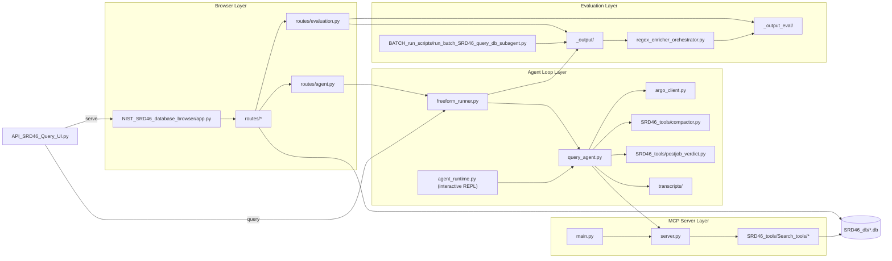

# Workspace Architecture

This document describes the actual architecture present in this workspace. It is based on the current files and module layout, not an earlier planned structure.

## Top-Level Runtime Map

## Core Components

### 0. Unified entry point

[API_SRD46_Query_UI.py](./API_SRD46_Query_UI.py) is the recommended top-level dispatcher. It exposes two argparse subcommands:

- `serve` (default if no subcommand is given) — boots the Flask browser by importing `NIST_SRD46_database_browser/app.py` after adding the package directory to `sys.path`. Accepts `--host`, `--port`, `--debug`.
- `query` — invokes [freeform_runner.py](./freeform_runner.py) directly, mirroring its CLI: `prompt` (text or `@file`), `-m/--model`, `-t/--timeout`, `--max-turns`, `--title`, `--no-enrich`, `--skip-claim-validation`, `--enable-sql/--disable-sql`.

It does not replace the lower-level entry points; `main.py`, `server.py`, `agent_runtime.py`, `freeform_runner.py`, and the browser's `app.py` are all still independently runnable.

### 1. MCP server layer

- [main.py](./main.py) is the preferred entry point and only chooses transport (`stdio` vs `sse`).
- [server.py](./server.py) owns the FastMCP app, tool registration, type coercion helpers, and runtime instructions.
- The server imports [SRD46_tools/Search_tools/__init__.py](./SRD46_tools/Search_tools/__init__.py) as the tool backend namespace.

The registered tool groups are:

| Group | Tools | Backing module |
|---|---|---|
| Phase gating | `0_preplan_decision`, `0_plan_search_strategy` | [SRD46_tools/strategy_planner.py](./SRD46_tools/strategy_planner.py) |
| Entity resolution | `search_metals`, `search_ligands` | [SRD46_tools/Search_tools/entity_search.py](./SRD46_tools/Search_tools/entity_search.py) |
| System catalog | `build_system_catalog` | [SRD46_tools/Search_tools/system_catalog.py](./SRD46_tools/Search_tools/system_catalog.py) |
| Stability search | `search_stability` | [SRD46_tools/Search_tools/stability_search.py](./SRD46_tools/Search_tools/stability_search.py) |
| pKa search | `search_pka_values`, `search_pka_ligands` | [SRD46_tools/Search_tools/pka_search.py](./SRD46_tools/Search_tools/pka_search.py) |
| Network search | `search_networks` | [SRD46_tools/Search_tools/network_search.py](./SRD46_tools/Search_tools/network_search.py) |
| Citation search | `search_citations` | [SRD46_tools/Search_tools/citation_search.py](./SRD46_tools/Search_tools/citation_search.py) |
| Card inspection | `inspect_card`, `inspect_literature` | [SRD46_tools/Search_tools/card_inspect.py](./SRD46_tools/Search_tools/card_inspect.py) |
| Aggregates and SQL | `db_count_records`, `db_distribution`, `db_ranked_pairs`, `get_table_schema`, `execute_srd46_sql` | [SRD46_tools/Search_tools/aggregate_and_sql.py](./SRD46_tools/Search_tools/aggregate_and_sql.py) |
| Similarity | `search_similar_ligands` | [SRD46_tools/Search_tools/similarity_search.py](./SRD46_tools/Search_tools/similarity_search.py) |

## 2. Agent loop layer

The agent loop has two front doors that both drive the same core orchestrator:

- **One-shot / browser-driven** — [freeform_runner.py](./freeform_runner.py) `run_freeform_query(...)` is invoked by the unified `query` subcommand and by the browser's `/agent` route. It writes the standard `_output/Model_<m>/Q*/...` triplet and (unless suppressed) the `_output_eval/Model_<m>/Q*/...` answer + claim artifacts.
- **Interactive REPL** — [agent_runtime.py](./agent_runtime.py) is the legacy terminal-chat entry point that builds the system prompt from FastMCP tool metadata, enforces phase gating, opens an MCP session, and drives a multi-turn conversation through `query_agent.run_agent_query`.

Shared modules:

- [query_agent.py](./query_agent.py)
  - core orchestration loop (`run_agent_query`, `run_agent_query_sync`)
  - MCP execution lifecycle
  - memory compaction integration
  - runtime diagnostics capture
- [argo_client.py](./argo_client.py)
  - Argo HTTP transport with retry / pacing
- [argo_config.py](./argo_config.py)
  - models (`MODEL`, `PLANNER_MODEL`, `VERDICT_MODEL`, `CLAIM_CLASSIFIER_MODEL`, `GROUNDER_MODEL`, ...)
  - `API_USER` (overridable via `ARGO_API_USER`)
  - `MCP_BLOCKED_TOOLS` (overridable via `SRD46_BLOCKED_MCP_TOOLS`)
  - `MAX_TOOL_ITERATIONS = 20`, `MAX_TURN_SECONDS = 600`
  - `ARGO_MAX_CONCURRENT_REQUESTS = 10`
- [terminal_chat.py](./terminal_chat.py)
  - prompt-toolkit input handling and transcript persistence
- [SRD46_tools/compactor.py](./SRD46_tools/compactor.py), [SRD46_tools/postjob_verdict.py](./SRD46_tools/postjob_verdict.py), [SRD46_tools/strategy_planner.py](./SRD46_tools/strategy_planner.py)
  - LLM-backed memory compactor, post-run verdict reviewer, and search-strategy planner

Important architectural property: neither front door queries the databases directly. Both go through the MCP tool layer exposed by [server.py](./server.py), which keeps the query surface centralized.

## 3. Browser layer

The browser lives in [NIST_SRD46_database_browser/](./NIST_SRD46_database_browser/) and is a direct Flask application, not an MCP client.

### Files with central responsibility

- [NIST_SRD46_database_browser/app.py](./NIST_SRD46_database_browser/app.py)
  - Flask app creation
  - blueprint registration
  - dashboard route
  - local dev server on port 5046
- [NIST_SRD46_database_browser/db.py](./NIST_SRD46_database_browser/db.py)
  - read-only SQLite path resolution
  - optional `SRD46_DB_DIR` override
  - optional Pourbaix CSV loading
- [NIST_SRD46_database_browser/request_dbs.py](./NIST_SRD46_database_browser/request_dbs.py)
  - request-scoped DB handles for cards, equilibrium, literature, and fingerprint DBs

### Registered route modules

- [NIST_SRD46_database_browser/routes/metals.py](./NIST_SRD46_database_browser/routes/metals.py)
- [NIST_SRD46_database_browser/routes/ligands.py](./NIST_SRD46_database_browser/routes/ligands.py)
- [NIST_SRD46_database_browser/routes/stability.py](./NIST_SRD46_database_browser/routes/stability.py)
- [NIST_SRD46_database_browser/routes/pka.py](./NIST_SRD46_database_browser/routes/pka.py)
- [NIST_SRD46_database_browser/routes/equilibrium.py](./NIST_SRD46_database_browser/routes/equilibrium.py)
- [NIST_SRD46_database_browser/routes/literature.py](./NIST_SRD46_database_browser/routes/literature.py)
- [NIST_SRD46_database_browser/routes/similarity.py](./NIST_SRD46_database_browser/routes/similarity.py)
- [NIST_SRD46_database_browser/routes/pourbaix.py](./NIST_SRD46_database_browser/routes/pourbaix.py)
- [NIST_SRD46_database_browser/routes/agent.py](./NIST_SRD46_database_browser/routes/agent.py)
- [NIST_SRD46_database_browser/routes/evaluation.py](./NIST_SRD46_database_browser/routes/evaluation.py)

### Current status notes

- The browser is active for direct browse/search/eval workflows.
- The evaluation route is real and reads `_output/` and `_output_eval/`.
- The `/agent` route is fully wired:
  - `GET /agent/` renders the launch form (prompt, model, max-turns, timeout, **ANL API username**, simulate, claim-validation toggle).
  - `POST /agent/launch` validates the API user, instantiates an `AgentRun`, calls `_apply_api_user(api_user)` to patch `os.environ["ARGO_API_USER"]`, `argo_config.API_USER`, and the already-imported bindings in `argo_client`, `SRD46_tools.strategy_planner`, and `terminal_chat`, and starts a worker thread that calls `freeform_runner.run_freeform_query`.
  - `GET /agent/stream/<run_id>` streams DEBUG-level log lines back to the browser as Server-Sent Events.
  - `GET /agent/status/<run_id>` returns a JSON snapshot.
  - On completion the page embeds `/eval/<model>/<qid>/<batch>` in an iframe so the standard claim panels render in place.
- A simulate-mode toggle is available for offline UI exercises (no Argo traffic).
- The Pourbaix section is optional: if the auxiliary CSV is absent, the browser still runs and the Pourbaix dataset is simply empty.

## 4. Output-evaluation layer

The package [SRD46_query_output_eval_pipeline/](./SRD46_query_output_eval_pipeline/) has become the shared runtime for post-processing agent outputs.

### Active subareas

- [SRD46_query_output_eval_pipeline/input_support_helpers/](./SRD46_query_output_eval_pipeline/input_support_helpers/)
  - scan and parse `_output/` artifacts
- [SRD46_query_output_eval_pipeline/db_support_helpers/](./SRD46_query_output_eval_pipeline/db_support_helpers/)
  - read-only DB reference helpers for grounding
- [SRD46_query_output_eval_pipeline/regex_enricher/](./SRD46_query_output_eval_pipeline/regex_enricher/)
  - claim classification
  - claim grounding
  - validation output generation
  - HTML rendering support for the browser
- [SRD46_query_output_eval_pipeline/tool_stats/](./SRD46_query_output_eval_pipeline/tool_stats/)
  - tool-call analytics and aggregation
- [SRD46_query_output_eval_pipeline/posteval_stats/](./SRD46_query_output_eval_pipeline/posteval_stats/)
  - post-evaluation summary and audit outputs
- [SRD46_query_output_eval_pipeline/workflow_diagram_builder/](./SRD46_query_output_eval_pipeline/workflow_diagram_builder/)
  - workflow visualization support

### Output contracts

Raw benchmark results are written into [_output/](./_output/), typically as:

- `Q*_result_batch*.md`
- `Q*_history_batch*.md`
- `Q*_ref_ids_batch*.md`

Where the question id is either a dotted integer for the curated test set
(e.g. `Q1.2.3`) or a `Qfree_<YYYYMMDD_HHMMSS>` token for ad-hoc runs from
[freeform_runner.py](./freeform_runner.py). Both shapes flow through the
same eval pipeline and browser viewer.

Derived claim-eval artifacts land in [_output_eval/](./_output_eval/), including:

- `answer_batch*.md`
- `tool_eval_batch*.md`
- `claims_batch*.json`
- `validation_batch*.md`
- summary and stats files

## 5. Batch and automation layer

All batch runners now live under [BATCH_run_scripts/](./BATCH_run_scripts/). Each `.py` script resolves the project root as `Path(__file__).parent.parent` and re-roots `sys.path` and `os.chdir`, so they can be launched from anywhere.

### Query benchmark runner

[BATCH_run_scripts/run_batch_SRD46_query_db_subagent.py](./BATCH_run_scripts/run_batch_SRD46_query_db_subagent.py) is the main prompt-benchmark script.

It does all of the following:

- parses [TEST_PROMPTS.md](./TEST_PROMPTS.md)
- runs prompts through the agentic loop
- coordinates shared Argo request pacing across workers
- writes prompt-level results and histories into `_output/`
- supports model matrices and repeat batches

The shell wrapper [BATCH_run_scripts/run_batch_SRD46_query_db_subagent.sh](./BATCH_run_scripts/run_batch_SRD46_query_db_subagent.sh) currently runs four models across repeated batches with explicit Argo pacing flags.

### Claim-enrichment runner

[BATCH_run_scripts/run_batch_output_claim_eval_subagent.py](./BATCH_run_scripts/run_batch_output_claim_eval_subagent.py) is intentionally thin. It just forwards into [SRD46_query_output_eval_pipeline/regex_enricher_orchestrator.py](./SRD46_query_output_eval_pipeline/regex_enricher_orchestrator.py).

The shell wrapper [BATCH_run_scripts/run_batch_output_claim_eval_subagent.sh](./BATCH_run_scripts/run_batch_output_claim_eval_subagent.sh) invokes that same entry point without additional orchestration logic.

### Freeform query runner

[freeform_runner.py](./freeform_runner.py) is the ad-hoc counterpart to the
test-set batch runner and is also the implementation behind the unified
`API_SRD46_Query_UI.py query` subcommand and the browser's `/agent` page.
It executes a single user prompt through the agent loop and writes the same
triplet (`Q*_result_*.md`, `Q*_history_*.md`, `Q*_ref_ids_*.md`) into
`_output/Model_<m>/Qfree_<ts>/`, then calls the eval pipeline's
`extract_run` and `enrich_run_claims` to produce
`_output_eval/Model_<m>/Qfree_<ts>/{answer,tool_eval}_batch1.md` and
`claims_batch1.json`. It writes `argo_config.MODEL` (and the planner /
verdict model variables) from the `-m` flag so the agent actually uses
the selected model.

The shell wrapper [BATCH_run_scripts/run_freeform_fe_corrected.sh](./BATCH_run_scripts/run_freeform_fe_corrected.sh) is an example loop that runs a saved prompt under multiple models; freeform prompt files live under [_output/_freeform_prompts/](./_output/_freeform_prompts/).

The `Qfree_<timestamp>` question-id prefix is the only thing distinguishing
freeform runs from curated test-set runs on disk:

- the eval pipeline's scan regex accepts both (`Q[\w.-]+`),
- the browser's `/eval/` index hides `Qfree_*` rows,
- the browser's `/eval/freeform/` index lists only `Qfree_*` rows,
- per-run viewing at `/eval/<model>/<qid>/<batch>` is shared.

## Data Layer

The active SRD-46 database directory is [SRD46_db/](./SRD46_db/):

| File | Current size | Used by |
|---|---:|---|
| `srd46_cards.db` | 158 MB | MCP tools, browser, grounding helpers |
| `srd46_equilibrium_maps.db` | 28 MB | MCP network tools, browser network views |
| `srd46_literature.db` | 45 MB | citation search, browser literature routes, grounding helpers |
| `srd46_ligand_fingerprints.db` | 996 MB | similarity search, browser similarity routes |

These files are large enough that the repository should be treated as a Git LFS repo for `.db` assets.

## Typical End-To-End Flows

### MCP client flow

1. Client starts [main.py](./main.py) or [server.py](./server.py).
2. `server.py` registers 18 tools on a FastMCP instance.
3. Tool functions delegate into [SRD46_tools/Search_tools/](./SRD46_tools/Search_tools/).
4. Search modules open the appropriate SRD-46 SQLite DBs and return JSON-serializable results.

### Interactive terminal flow

1. User runs [agent_runtime.py](./agent_runtime.py).
2. The runtime builds a tool catalog from the FastMCP server metadata.
3. Prompts are sent through the Argo-backed reasoning loop in [query_agent.py](./query_agent.py).
4. The agent issues MCP tool calls to the server tool layer.
5. Memory compaction and post-job verdict logic run around the tool loop.
6. Final transcripts are stored in [transcripts/](./transcripts/).

### One-shot CLI flow (recommended for ad-hoc questions)

1. User runs `python API_SRD46_Query_UI.py query "..." -m gpt54`.
2. The `query` subcommand calls `freeform_runner.run_freeform_query`, which sets `argo_config.MODEL/PLANNER_MODEL/VERDICT_MODEL` and invokes `query_agent.run_agent_query_sync`.
3. Raw artifacts are written to `_output/Model_<m>/Qfree_<ts>/`.
4. Unless suppressed, `extract_run` + `enrich_run_claims` populate `_output_eval/Model_<m>/Qfree_<ts>/`.
5. The same artifacts are immediately viewable at `/eval/<m>/Qfree_<ts>/1` in the browser.

### Browser /agent flow

1. User opens `/agent` in the Flask browser, fills in prompt + model + ANL username, and submits.
2. `routes/agent.py` calls `_apply_api_user(api_user)` to patch the in-process Argo username everywhere it's bound.
3. A worker thread runs `freeform_runner.run_freeform_query` while a `_RunLogHandler` mirrors all log records into a per-run buffer.
4. The page consumes `/agent/stream/<run_id>` (SSE) for live log + status updates.
5. On `completed`, the page swaps in an iframe pointing at `/eval/<model>/<qid>/<batch>` so the standard claim review surface renders inline.

### Query benchmark to claim evaluation flow

1. [BATCH_run_scripts/run_batch_SRD46_query_db_subagent.py](./BATCH_run_scripts/run_batch_SRD46_query_db_subagent.py) writes raw results into [_output/](./_output/).
2. [BATCH_run_scripts/run_batch_output_claim_eval_subagent.py](./BATCH_run_scripts/run_batch_output_claim_eval_subagent.py) or the orchestrator parses those runs.
3. The claim pipeline writes grounded artifacts into [_output_eval/](./_output_eval/).
4. Browser eval views render those artifacts for inspection.

### Browser evaluation flow

1. User opens `/eval` in the Flask browser.
2. [NIST_SRD46_database_browser/routes/evaluation.py](./NIST_SRD46_database_browser/routes/evaluation.py) discovers available models, questions, and batches from `_output/`.
3. It loads cached claim artifacts from `_output_eval/` when present.
4. It renders raw markdown, claim views, or regex-enriched views depending on mode and cache state.

## Repository Boundaries And Caveats

- The repo is both source code and working data workspace. Generated outputs are intentionally present.
- [__obsolete__/](./__obsolete__/) contains archived code and old outputs (including a prior `pyproject.toml`). It is not the main runtime path.
- The live runtime depends on the Argo API configured in [argo_config.py](./argo_config.py); this is not a standalone public-cloud setup.
- Install dependencies from [requirements.txt](./requirements.txt). There is no top-level `pyproject.toml`.
- The browser route structure is `routes/`, not `blueprints/`.
- There is no separate browser design document in the repo right now; this file is the workspace-level architecture reference.