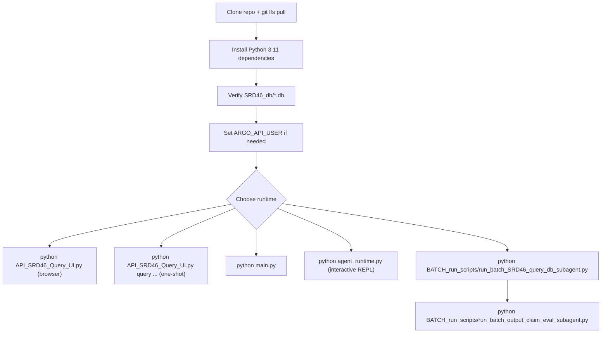

# SRD-46 Database Workspace Installation Guide

This workspace bundles the SRD-46 MCP server, terminal agent runtime, Flask browser, batch runners, and the post-run claim-evaluation pipeline.

## Setup Flow



## Prerequisites

- Python 3.11 or newer
- Access to the internal Argo API used by the agent runtime and evaluation pipeline
- The SRD-46 SQLite databases under `SRD46_db/`
- Git LFS if you are cloning the repo with `.db` assets tracked externally

## 1. Install Dependencies

Install workspace dependencies from `requirements.txt`:

```bash
pip install -r requirements.txt
```

There is no top-level `pyproject.toml`; the previous one has been moved into `__obsolete__/`.

Core packages:

- `fastmcp`, `mcp`: MCP server/client transport
- `requests`: Argo HTTP client transport
- `prompt_toolkit`: multiline terminal chat UI
- `rdkit`, `pubchempy`: chemical resolution and ligand similarity support
- `flask`, `markdown`, `markupsafe`: browser UI support

If you only need the MCP server and terminal runtime, the minimal install is:

```bash
pip install fastmcp mcp requests prompt_toolkit
```

If `rdkit` is difficult to install via `pip`, use a conda-forge build.

## 2. Verify Database Assets

The active databases live under `SRD46_db/`:

| Database | Purpose |
|---|---|
| `srd46_cards.db` | primary cards, stability constants, pKa values, and citation links |
| `srd46_equilibrium_maps.db` | equilibrium map and network data |
| `srd46_literature.db` | literature catalog and citation mappings |
| `srd46_ligand_fingerprints.db` | precomputed ligand similarity fingerprints |

The browser resolves the DB directory in this order:

1. `SRD46_DB_DIR`
2. `NIST_SRD46_core_db_storage/`
3. `SRD46_db/`

If the databases are not stored in the repo-default location, set:

```bash
set SRD46_DB_DIR=N:/path/to/db/folder
```

## 3. Configure Argo Access

The runtime configuration lives in `argo_config.py`.

Current defaults include:

- `MODEL = "gpt54"`
- `VERDICT_MODEL = "gpt54"`
- `PLANNER_MODEL = "gpt54"`
- `ENRICHER_MODEL = "gpt54"`
- `CLAIM_CLASSIFIER_MODEL = "gpt5"` (fallback `"gpt54"`)
- `GROUNDER_MODEL = "gpt5"` (fallback `"gpt54"`)
- `MAX_TOOL_ITERATIONS = 20`, `MAX_TURN_SECONDS = 600`
- `ARGO_MAX_CONCURRENT_REQUESTS = 10`
- `MCP_BLOCKED_TOOLS = ""` (empty by default)

The API user defaults to whatever `ARGO_API_USER` is set to (otherwise the hardcoded default in `argo_config.py`):

```bash
set ARGO_API_USER=your.username
```

Three per-process overrides apply at runtime:

- `ARGO_API_USER` — ANL Argo username sent on every request.
- `SRD46_BLOCKED_MCP_TOOLS` — comma-separated tool names to hide from the agent (e.g. `execute_srd46_sql`).
- The browser's `/agent` page accepts a per-run username, which is patched into `os.environ["ARGO_API_USER"]`, `argo_config.API_USER`, and the already-imported bindings in `argo_client`, `SRD46_tools.strategy_planner`, and `terminal_chat` for the lifetime of the process.

## 4. Launch The Components

### Unified entry point (recommended)

[API_SRD46_Query_UI.py](./API_SRD46_Query_UI.py) wraps both the Flask browser and the freeform query runner behind one CLI:

```bash
# Launch the browser (default if no subcommand is given)
python API_SRD46_Query_UI.py
python API_SRD46_Query_UI.py serve --host 0.0.0.0 --port 8080 --debug

# Run a single freeform conversation (writes _output/ + _output_eval/ artifacts)
python API_SRD46_Query_UI.py query "List Fe(III) ligands with logK > 20" -m gpt54
python API_SRD46_Query_UI.py query @prompts/fe.txt -m claudeopus46 --max-turns 40
python API_SRD46_Query_UI.py query "..." -m gpt54 --no-enrich --skip-claim-validation
```

### MCP server

Start the FastMCP server over stdio:

```bash
python main.py
```

Start it with SSE transport:

```bash
python main.py --sse
```

### Interactive terminal agent (legacy REPL)

```bash
python agent_runtime.py
```

This launches the phase-gated chat runtime that delegates all database access through the MCP tool layer. For a one-shot query, prefer `python API_SRD46_Query_UI.py query "..." -m gpt54` instead.

### Flask browser

Preferred:

```bash
python API_SRD46_Query_UI.py serve
```

Direct launch is still supported:

```bash
python NIST_SRD46_database_browser/app.py
```

The browser binds to `http://127.0.0.1:5046` and provides direct browse/search views, evaluation review under `/eval`, and a fully wired live agent runner under `/agent`.

### Batch prompt runner

The batch runners now live under [BATCH_run_scripts/](./BATCH_run_scripts/). The `.py` files re-root themselves via `Path(__file__).parent.parent`, so they can be launched from anywhere:

```bash
python BATCH_run_scripts/run_batch_SRD46_query_db_subagent.py
python BATCH_run_scripts/run_batch_SRD46_query_db_subagent.py 1.1.1 2.1.3
python BATCH_run_scripts/run_batch_SRD46_query_db_subagent.py --section 3
python BATCH_run_scripts/run_batch_SRD46_query_db_subagent.py -m gpt5 gpt54 -r 3 -j 4
```

Important flags:

- `--section` / `-s`
- `--parallel` / `-j`
- `--models` / `-m`
- `--repeats` / `-r`
- `--argo-min-interval`
- `--argo-max-inflight`
- `--argo-cooldown`
- `--verbose-history`

Shell wrappers (run from the repo root):

```bash
bash BATCH_run_scripts/run_batch_SRD46_query_db_subagent.sh
bash BATCH_run_scripts/run_freeform_fe_corrected.sh
```

### Claim-evaluation pipeline

Thin wrapper:

```bash
python BATCH_run_scripts/run_batch_output_claim_eval_subagent.py --model gpt54 --question Q1.1.1 --workers 1 --force
```

Direct orchestrator entry point:

```bash
python -m SRD46_query_output_eval_pipeline.regex_enricher_orchestrator --model gpt54 --question Q1.1.1 --workers 1 --force
python -m SRD46_query_output_eval_pipeline.regex_enricher_orchestrator --extract-only
python -m SRD46_query_output_eval_pipeline.regex_enricher_orchestrator --publish-eval-stats --publish-tool-stats
```

## 5. Output Locations

Raw agent runs are written to `_output/`:

- `Q*_result_batch*.md`
- `Q*_history_batch*.md`
- `Q*_ref_ids_batch*.md`
- `SUMMARY_batch*.md`

Derived evaluation artifacts are written to `_output_eval/`:

- `answer_batch*.md`
- `tool_eval_batch*.md`
- `claims_batch*.json`
- `validation_batch*.md`
- `Eval_Stats/` published statistics

## 6. Tests

All tests live under `DEBUG_test_scripts/` (a `conftest.py` is included). There is no separate top-level `tests/` directory.

```bash
pytest -q DEBUG_test_scripts
```

`TEST_PROMPTS.md` currently defines 56 benchmark prompts across direct lookup, provenance, comparison, aggregate profiling, multi-step reasoning, thermodynamic reasoning, hypothesis generation, ambiguous prompts, and negative cases.

## Troubleshooting

| Problem | Likely fix |
|---|---|
| `ModuleNotFoundError` for `fastmcp`, `mcp`, or `requests` | reinstall root requirements |
| Browser starts but some sections fail | verify all four SRD-46 DB files are present |
| Browser cannot locate databases | set `SRD46_DB_DIR` to the directory containing the `.db` files |
| Agent or eval pipeline fails immediately on API calls | set `ARGO_API_USER` and verify Argo network access |
| Ligand similarity features fail | install `rdkit` and verify `srd46_ligand_fingerprints.db` exists |
