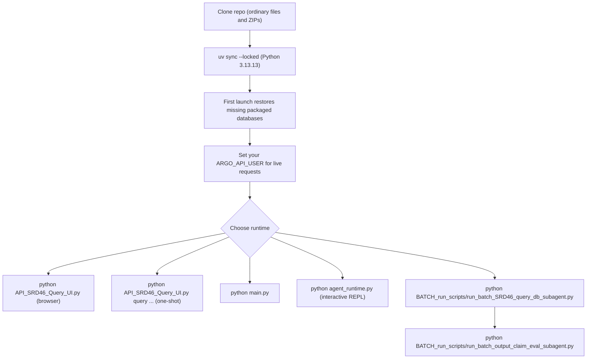

# SRD-46 Database Workspace Installation Guide

This workspace bundles the SRD-46 MCP server, terminal agent runtime, Flask browser, batch runners, and the post-run claim-evaluation pipeline.

## Setup Flow


```mermaid
flowchart TD
    clone["Clone repo (ordinary files and ZIPs)"] --> deps["uv sync --locked (Python 3.13.13)"]
    deps --> db["First launch restores missing packaged databases"]
    db --> argo["Set your ARGO_API_USER for live requests"]
    argo --> choice{"Choose runtime"}
    choice --> api["python API_SRD46_Query_UI.py (browser)"]
    choice --> apiquery["python API_SRD46_Query_UI.py query ... (one-shot)"]
    choice --> mcp["python main.py"]
    choice --> repl["python agent_runtime.py (interactive REPL)"]
    choice --> batch["python BATCH_run_scripts/run_batch_SRD46_query_db_subagent.py"]
    batch --> eval["python BATCH_run_scripts/run_batch_output_claim_eval_subagent.py"]
```

## Prerequisites

- Python 3.13.13 for the locked reproducibility environment; uv 0.8.15 was tested
- Access to the internal Argo API used by the agent runtime and evaluation pipeline
- The SRD-46 SQLite databases under `SRD46_db/`
- About 1 GiB free for the two restored database files, in addition to the checkout and Python environment

## 1. Install Dependencies

Run from the repository root using **uv 0.8.15** (the tested version):

```bash
uv sync --locked
uv run --locked python API_SRD46_Query_UI.py query --help
```

The root [.python-version](./.python-version) selects **Python 3.13.13**. [pyproject.toml](./pyproject.toml) declares the dependency set, and [uv.lock](./uv.lock) records exact resolved versions and package hashes. `uv sync --locked` creates `.venv` and checks that the lock matches the project without updating it. For the remaining commands in this guide, use `uv run --locked python ...`, or activate `.venv` before using `python` directly.

For pip installation, create and activate a clean Python 3.13.13 virtual environment, then install the sole root [requirements.txt](./requirements.txt), a hash-pinned export generated from the lock:

```bash
python -m pip install --require-hashes -r requirements.txt
```

See [ENVIRONMENT.md](./ENVIRONMENT.md) for platform-specific setup, verification commands, and environment provenance. This is a documented reproducibility baseline; it is not presented as a recovered record of the exact historical experiment environment.

Core packages:

- `fastmcp`, `mcp`, `pydantic`: MCP server/client transport and tool schemas
- `requests`: Argo HTTP client transport
- `sqlglot`: SQL parsing and normalization
- `prompt_toolkit`: multiline terminal chat UI
- `rdkit`, `pubchempy`: chemical resolution and ligand similarity support
- `flask`, `markdown`, `markupsafe`: browser UI support
- `numpy`, `matplotlib`: query-evaluation statistics and plots

## 2. Verify Database Assets

The active databases live under `SRD46_db/`. Keep all three database ZIPs from the checkout in this directory. On first launch, the browser, query CLI, MCP server, and database tools restore missing packaged originals before accessing them. Restoration checks every part and the reconstructed file against the manifest; it does not rebuild or regenerate data.

An explicit setup check is also available and needs only the Python standard library:

```bash
python workspace_setup.py --verify
```

See [PACKAGED_DATA.md](./PACKAGED_DATA.md) for the exact archive layout, checksums, and publication rules. Existing database files are preserved; normal startup checks their sizes, while `--verify` also checks their SHA-256 hashes.

| Database | Purpose |
|---|---|
| `srd46_cards.db` | primary cards, stability constants, pKa values, and citation links |
| `srd46_equilibrium_maps.db` | equilibrium map and network data |
| `srd46_literature.db` | literature catalog and citation mappings |
| `srd46_ligand_fingerprints.db` | precomputed ligand similarity fingerprints |

The browser resolves the DB directory in this order:

1. `SRD46_DB_DIR`
2. `NIST_SRD46_core_db_storage/`
3. `SRD46_db/`

If the databases are not stored in the repo-default location, set:

```bash
set SRD46_DB_DIR=N:/path/to/db/folder
```

## 3. Configure Argo Access

The runtime configuration lives in `argo_config.py`.

Current defaults include:

- `MODEL = "gpt54"`
- `VERDICT_MODEL = "gpt54"`
- `PLANNER_MODEL = "gpt54"`
- `ENRICHER_MODEL = "gpt54"`
- `CLAIM_CLASSIFIER_MODEL = "gpt5"` (fallback `"gpt54"`)
- `GROUNDER_MODEL = "gpt5"` (fallback `"gpt54"`)
- `MAX_TOOL_ITERATIONS = 20`, `MAX_TURN_SECONDS = 600`
- `ARGO_MAX_CONCURRENT_REQUESTS = 10`
- `MCP_BLOCKED_TOOLS = ""` (empty by default)

Supply your own authorized Argo username through `ARGO_API_USER` before making live requests. There is no default personal account; an empty username fails before any HTTP request:

```bash
set ARGO_API_USER=your.username
```

Per-process overrides apply at runtime:

- `ARGO_API_USER` — ANL Argo username sent on every request.
- `ARGO_API_URL` — overrides the default Argo chat endpoint.
- `SRD46_BLOCKED_MCP_TOOLS` — comma-separated tool names to hide from the agent (e.g. `execute_srd46_sql`).
- The browser's `/agent` page accepts a per-run username, which is patched into `os.environ["ARGO_API_USER"]`, `argo_config.API_USER`, and the already-imported bindings in `argo_client`, `SRD46_tools.strategy_planner`, and `terminal_chat` for the lifetime of the process.

## 4. Launch The Components

### Unified entry point (recommended)

[API_SRD46_Query_UI.py](./API_SRD46_Query_UI.py) wraps both the Flask browser and the freeform query runner behind one CLI:

```bash
# Launch the browser (default if no subcommand is given)
python API_SRD46_Query_UI.py
python API_SRD46_Query_UI.py serve --host 0.0.0.0 --port 8080 --debug

# Run a single freeform conversation (writes _output/ + _output_eval/ artifacts)
python API_SRD46_Query_UI.py query "List Fe(III) ligands with logK > 20" -m gpt54
python API_SRD46_Query_UI.py query @prompts/fe.txt -m claudeopus46 --max-turns 40
python API_SRD46_Query_UI.py query "..." -m gpt54 --no-enrich --skip-claim-validation
```

### MCP server

Start the FastMCP server over stdio:

```bash
python main.py
```

Start it with SSE transport:

```bash
python main.py --sse
```

### Interactive terminal agent (legacy REPL)

```bash
python agent_runtime.py
```

This launches the phase-gated chat runtime that delegates all database access through the MCP tool layer. For a one-shot query, prefer `python API_SRD46_Query_UI.py query "..." -m gpt54` instead.

### Flask browser

Preferred:

```bash
python API_SRD46_Query_UI.py serve
```

Direct launch is still supported:

```bash
python NIST_SRD46_database_browser/app.py
```

The browser binds to `http://127.0.0.1:5046` and provides direct browse/search views, evaluation review under `/eval`, and a fully wired live agent runner under `/agent`.

### Batch prompt runner

The batch runners now live under [BATCH_run_scripts/](./BATCH_run_scripts/). The `.py` files re-root themselves via `Path(__file__).parent.parent`, so they can be launched from anywhere:

```bash
python BATCH_run_scripts/run_batch_SRD46_query_db_subagent.py
python BATCH_run_scripts/run_batch_SRD46_query_db_subagent.py 1.1.1 2.1.3
python BATCH_run_scripts/run_batch_SRD46_query_db_subagent.py --section 3
python BATCH_run_scripts/run_batch_SRD46_query_db_subagent.py -m gpt5 gpt54 -r 3 -j 4
```

Important flags:

- `--section` / `-s`
- `--parallel` / `-j`
- `--models` / `-m`
- `--repeats` / `-r`
- `--argo-min-interval`
- `--argo-max-inflight`
- `--argo-cooldown`
- `--verbose-history`

Shell wrappers (run from the repo root):

```bash
bash BATCH_run_scripts/run_batch_SRD46_query_db_subagent.sh
bash BATCH_run_scripts/run_freeform_fe_corrected.sh
```

### Claim-evaluation pipeline

Thin wrapper:

```bash
python BATCH_run_scripts/run_batch_output_claim_eval_subagent.py --model gpt54 --question Q1.1.1 --workers 1 --force
```

Direct orchestrator entry point:

```bash
python -m SRD46_query_output_eval_pipeline.regex_enricher_orchestrator --model gpt54 --question Q1.1.1 --workers 1 --force
python -m SRD46_query_output_eval_pipeline.regex_enricher_orchestrator --extract-only
python -m SRD46_query_output_eval_pipeline.regex_enricher_orchestrator --publish-eval-stats --publish-tool-stats
```

## 5. Output Locations

Raw agent runs are written to `_output/`:

- `Q*_result_batch*.md`
- `Q*_history_batch*.md`
- `Q*_ref_ids_batch*.md`
- `SUMMARY_batch*.md`

Derived evaluation artifacts are written to `_output_eval/`:

- `answer_batch*.md`
- `tool_eval_batch*.md`
- `claims_batch*.json`
- `validation_batch*.md`
- `Eval_Stats/` published statistics

## 6. Local Environment Check

Run the included check after installing the locked environment; it also restores missing packaged database assets:

```bash
uv run --locked python -B scripts/check_query_environment.py
```

This checks dependency versions, imports, chemical identifier conversion, PNG plotting, a browser page, the query CLI, and a local MCP database query without making model/API requests. See [ENVIRONMENT.md](./ENVIRONMENT.md) for its coverage and validation record. `pytest` is an optional developer dependency; the historical developer test suite is not included here.

`TEST_PROMPTS.md` currently defines 56 benchmark prompts across direct lookup, provenance, comparison, aggregate profiling, multi-step reasoning, thermodynamic reasoning, hypothesis generation, ambiguous prompts, and negative cases.

## Troubleshooting

| Problem | Likely fix |
|---|---|
| `ModuleNotFoundError` for `fastmcp`, `mcp`, or `requests` | reinstall root requirements |
| Missing ZIP part during startup | retrieve the named ZIP from the same checkout; keep both fingerprint parts together |
| Database size or checksum mismatch | preserve or back up your local file, then investigate the mismatch; setup will not overwrite it |
| Browser starts but some sections fail | run `python workspace_setup.py --verify` and verify all four SRD-46 DB files are present |
| Browser cannot locate databases | set `SRD46_DB_DIR` to the directory containing the `.db` files |
| Agent or eval pipeline fails immediately on API calls | set `ARGO_API_USER` and verify Argo network access |
| Ligand similarity features fail | install `rdkit` and verify `srd46_ligand_fingerprints.db` exists |
