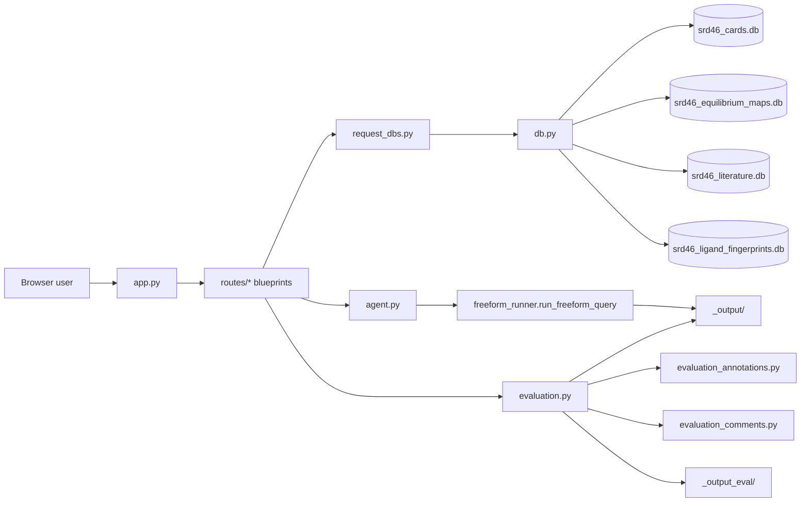

# NIST SRD-46 Database Browser

This directory contains the Flask browser for direct exploration of the SRD-46 databases and for reviewing claim-evaluation artifacts produced by the batch pipelines.

Unlike the terminal runtime, the browser does not use MCP. It opens the SQLite databases directly in read-only mode and renders browse/search pages from Flask blueprints.

## Browser Flow



## Main Files

- `app.py`: Flask app creation, blueprint registration, dashboard route, local dev server on port 5046
- `db.py`: read-only path resolution for SRD-46 databases and optional Pourbaix CSV loading
- `request_dbs.py`: request-scoped database handle management
- `requirements.txt`: minimal browser-only dependencies

## Registered Route Modules

- `routes/metals.py` (`/metals`): metal browse and detail views
- `routes/ligands.py` (`/ligands`): ligand browse and detail views
- `routes/stability.py` (`/stability`): stability-constant browse/search views
- `routes/pka.py` (`/pka`): pKa browse/search views
- `routes/equilibrium.py` (`/equilibrium`): equilibrium network inspection
- `routes/literature.py` (`/literature`): literature and citation views
- `routes/similarity.py` (`/similarity`): ligand similarity search backed by the fingerprint DB
- `routes/pourbaix.py` (`/pourbaix`): optional Pourbaix data views when the auxiliary CSV is present
- `routes/agent.py` (`/agent`): live agent runner with SSE log streaming and embedded eval iframe (see below)
- `routes/evaluation.py` (`/eval` and `/eval/freeform/`): evaluation dashboard backed by `_output/` and `_output_eval/`

The evaluation blueprint also depends on:

- `routes/evaluation_annotations.py`: manual claim annotation state and history management
- `routes/evaluation_comments.py`: evaluation comments and marker/scoring helpers

## Templates And Static Assets

The browser UI is rendered from `templates/` and enhanced with the assets in `static/`.

Notable templates include:

- `index.html`: dashboard
- `agent.html`: live agent runner page
- `metals.html`, `metal_detail.html`
- `ligands.html`, `ligand_detail.html`, `ligand_pka_detail.html`
- `stability.html`, `vlm_detail.html`, `pka.html`
- `equilibrium.html`, `collection_detail.html`
- `literature.html`, `similarity.html`, `pourbaix.html`, `pourbaix_detail.html`
- `eval_index.html`, `eval_run.html`
- `_eval_annotation_editor.html`, `_eval_comments_bar.html`

The equilibrium browser now uses a single collection page with nested accordions:

- `equilibrium.html`: search/select metal-ligand systems
- `collection_detail.html`: one-page map → network drill-down for a selected system

## Running The Browser

From the repo root, prefer the unified entry point:

```bash
python API_SRD46_Query_UI.py             # default subcommand is `serve`
python API_SRD46_Query_UI.py serve --host 0.0.0.0 --port 8080 --debug
```

Direct launch is still supported:

```bash
python NIST_SRD46_database_browser/app.py
```

Then open:

```text
http://127.0.0.1:5046
```

## /agent — Live Agent Runner

[routes/agent.py](./routes/agent.py) wires the `/agent` page to the same `freeform_runner.run_freeform_query` that powers the unified `python API_SRD46_Query_UI.py query ...` CLI.

### Endpoints

- `GET  /agent/` — launch form (prompt, model, max-turns, timeout, ANL API username, simulate, claim-validation toggle)
- `POST /agent/launch` — validates input, applies the API user, and starts a worker thread
- `GET  /agent/stream/<run_id>` — Server-Sent Events stream of DEBUG log lines + status transitions
- `GET  /agent/status/<run_id>` — JSON status snapshot

### ANL API user propagation

Because the agent runs **parallel** Argo HTTP calls, every request must carry an explicit `user` field so concurrent sessions don't clash and shared tokens aren't wasted. The launch form requires an ANL username, and on submit `_apply_api_user(api_user)` patches all in-process bindings:

- `os.environ["ARGO_API_USER"]`
- `argo_config.API_USER`
- already-imported names: `argo_client.API_USER`, `SRD46_tools.strategy_planner._API_USER`, `terminal_chat.API_USER`

The browser also remembers the last-used username in `localStorage` and prefills it from `argo_config.API_USER` on first load.

### Run lifecycle

1. `AgentRun` is created and the API user is patched.
2. A daemon thread runs `freeform_runner.run_freeform_query` while a `_RunLogHandler` mirrors all log records into a per-run buffer (capped at 20 000 lines) and an optional `<out_dir>/agent_log_batch1.log` file.
3. The page consumes `/agent/stream/<run_id>` for live updates.
4. On completion the page swaps in an iframe for `/eval/<model>/<qid>/<batch>` so claim panels render in place. A simulate-mode toggle replays a canned log + answer for offline UI testing without touching Argo.

## Data Resolution Rules

`db.py` resolves the SRD-46 database directory in this order:

1. `SRD46_DB_DIR`
2. `NIST_SRD46_core_db_storage/`
3. `SRD46_db/`

The browser accepts partial availability for optional datasets:

- If the Pourbaix CSV is missing, the browser still runs and the Pourbaix views stay empty.
- If only `srd46_cards.db` is available, the browser can start, but routes requiring the other databases will fail when used.

## Current Caveats

- The `/agent` page is fully wired and submits real Argo runs unless **Simulate run** is checked. Always provide your own ANL username before submitting to keep parallel Argo traffic from colliding with other users on the same backend.
- Evaluation views are real and read both `_output/` and `_output_eval/`.
- The browser is optimized for local inspection, not for multi-user deployment.

