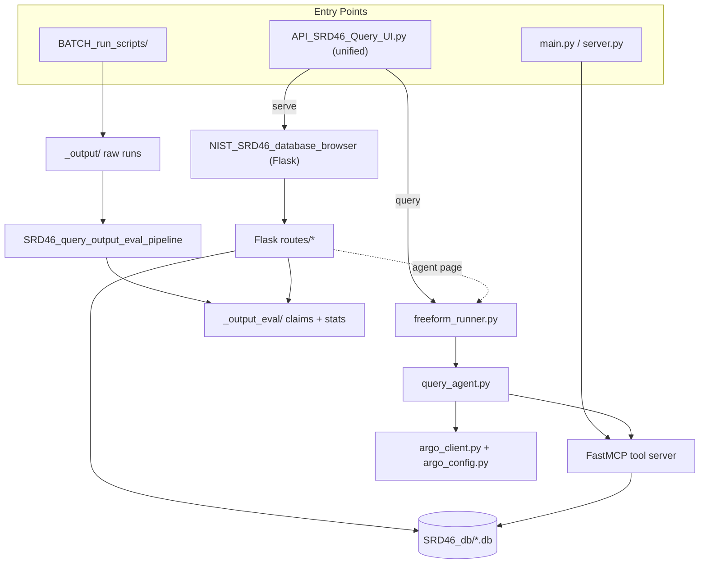

# SRD-46 Database Workspace

This repository is the working workspace for querying, browsing, and evaluating the NIST Standard Reference Database 46 (SRD-46), "Critically Selected Stability Constants of Metal Complexes".

It combines five active pieces of functionality in one repo:

1. a FastMCP server that exposes 18 SRD-46 tools
2. a terminal-based agent runtime that calls those tools through MCP
3. a Flask browser for direct database exploration and evaluation review
4. an output-evaluation pipeline for parsing runs and grounding claims
5. batch runners plus generated artifacts under `_output/` and `_output_eval/`

This workspace also keeps the SQLite databases and generated outputs in-repo. The `.db` files are large and should be treated as Git LFS assets.

## Component Map



## Workspace At A Glance

### Unified API entry point (recommended)

[API_SRD46_Query_UI.py](./API_SRD46_Query_UI.py) is the single recommended entry point. It exposes two argparse subcommands:

```bash
# Launch the Flask browser (default if no subcommand is given)
python API_SRD46_Query_UI.py
python API_SRD46_Query_UI.py serve --host 0.0.0.0 --port 8080 --debug

# Run a single freeform agent conversation from the terminal
python API_SRD46_Query_UI.py query "Compare Cu(II) vs Zn(II) EDTA stability" -m gpt54
python API_SRD46_Query_UI.py query @prompts/fe.txt -m claudeopus46 --max-turns 40
python API_SRD46_Query_UI.py query "..." -m gpt54 --no-enrich --skip-claim-validation
```

Under the hood `serve` boots [NIST_SRD46_database_browser/app.py](./NIST_SRD46_database_browser/app.py), and `query` calls [freeform_runner.py](./freeform_runner.py) which drives the same agent loop the browser uses.

### MCP server

- Entry points: [main.py](./main.py), [server.py](./server.py)
- Transport modes: `stdio` (default) and `sse` (`--sse`)
- Tool surface: 18 tools registered directly in `server.py`
- Backing implementation: [SRD46_tools/Search_tools/](./SRD46_tools/Search_tools/)

Run it with:

```bash
python main.py
python main.py --sse
```

### Terminal agent runtime

- Core loop: [query_agent.py](./query_agent.py) (`run_agent_query` / `run_agent_query_sync`)
- Legacy interactive entry point: [agent_runtime.py](./agent_runtime.py)
- LLM transport: [argo_client.py](./argo_client.py)
- Shared config: [argo_config.py](./argo_config.py)
- Terminal UI and transcript persistence: [terminal_chat.py](./terminal_chat.py)

The runtime uses a phase-gated workflow:

1. `0_preplan_decision`
2. L0 discovery tools (`search_metals`, `search_ligands`, `build_system_catalog`)
3. `0_plan_search_strategy`
4. execution tools

For a one-shot prompt, prefer the unified entry point:

```bash
python API_SRD46_Query_UI.py query "..." -m gpt54
```

For an interactive REPL session, run the legacy runtime:

```bash
python agent_runtime.py
```

### Flask browser

- App module: [NIST_SRD46_database_browser/app.py](./NIST_SRD46_database_browser/app.py)
- Read-only DB path resolution: [NIST_SRD46_database_browser/db.py](./NIST_SRD46_database_browser/db.py)
- Request-scoped connections: [NIST_SRD46_database_browser/request_dbs.py](./NIST_SRD46_database_browser/request_dbs.py)
- Route modules: [NIST_SRD46_database_browser/routes/](./NIST_SRD46_database_browser/routes/)

The browser currently exposes these sections:

- dashboard (`/`)
- metals (`/metals`)
- ligands (`/ligands`)
- stability (`/stability`)
- pKa (`/pka`)
- equilibrium networks (`/equilibrium`)
- literature (`/literature`)
- similarity (`/similarity`)
- Pourbaix (`/pourbaix`)
- eval (`/eval`) and freeform-run index (`/eval/freeform/`)
- agent (`/agent`) — live agent runner, see below

The `/agent` page is a real, fully wired runner. It accepts a prompt, model, max-turns, timeout, an **ANL API username** (sent as the `user` field on every Argo request to keep parallel sessions from colliding), an optional simulated mode, and an optional claim-validation toggle. It streams DEBUG-level log lines back through Server-Sent Events (`/agent/stream/<run_id>`), persists the same artifacts as a freeform run under `_output/Model_<m>/Qfree_<ts>/`, and on completion embeds the standard `/eval/<model>/<qid>/<batch>` view in an iframe so claim panels are reviewable on the same page.

Launch the browser with the unified entry point:

```bash
python API_SRD46_Query_UI.py            # binds 127.0.0.1:5046
python API_SRD46_Query_UI.py serve --host 0.0.0.0 --port 8080
```

Direct launch is still supported:

```bash
python NIST_SRD46_database_browser/app.py
```

### Output evaluation pipeline

The package [SRD46_query_output_eval_pipeline/](./SRD46_query_output_eval_pipeline/) is active and used by both the batch annotation flow and the evaluation browser.

Its current responsibilities are:

- parsing raw `_output/` run artifacts
- extracting tool results and answer fragments
- classifying and grounding claims
- writing claim caches and validation markdown into `_output_eval/`
- producing post-evaluation statistics and tool-usage summaries

Useful starting points:

- [SRD46_query_output_eval_pipeline/README.md](./SRD46_query_output_eval_pipeline/README.md)
- [SRD46_query_output_eval_pipeline/regex_enricher_orchestrator.py](./SRD46_query_output_eval_pipeline/regex_enricher_orchestrator.py)
- [SRD46_query_output_eval_pipeline/tool_stats/](./SRD46_query_output_eval_pipeline/tool_stats/)
- [SRD46_query_output_eval_pipeline/posteval_stats/](./SRD46_query_output_eval_pipeline/posteval_stats/)

### Batch runners

The batch runners now live in [BATCH_run_scripts/](./BATCH_run_scripts/):

- [BATCH_run_scripts/run_batch_SRD46_query_db_subagent.py](./BATCH_run_scripts/run_batch_SRD46_query_db_subagent.py): prompt benchmark runner for [TEST_PROMPTS.md](./TEST_PROMPTS.md)
- [BATCH_run_scripts/run_batch_output_claim_eval_subagent.py](./BATCH_run_scripts/run_batch_output_claim_eval_subagent.py): thin wrapper over the regex-enricher orchestrator

Companion shell wrappers:

- [BATCH_run_scripts/run_batch_SRD46_query_db_subagent.sh](./BATCH_run_scripts/run_batch_SRD46_query_db_subagent.sh)
- [BATCH_run_scripts/run_batch_output_claim_eval_subagent.sh](./BATCH_run_scripts/run_batch_output_claim_eval_subagent.sh)
- [BATCH_run_scripts/run_freeform_fe_corrected.sh](./BATCH_run_scripts/run_freeform_fe_corrected.sh)

Each `.py` script resolves the project root as `Path(__file__).parent.parent`, so it works whether you launch it from the repo root or from inside `BATCH_run_scripts/`.

### Freeform (ad-hoc) query runner

[freeform_runner.py](./freeform_runner.py) runs a single non-test-set prompt
through the same agent loop and produces the same on-disk artifacts as the
test-set batch runner, so the eval pipeline and the browser can render and
annotate the result with no extra wiring. The unified entry point's `query`
subcommand is the recommended front door, but `freeform_runner.py` is also
directly callable for backwards compatibility.

```bash
# Preferred: via the unified entry point
python API_SRD46_Query_UI.py query "Compare Cu(II) vs Zn(II) EDTA stability" -m claudeopus46 -t 20000
python API_SRD46_Query_UI.py query "@_output/_freeform_prompts/fe_iii_vs_fe_ii_ligand.txt" -m claudeopus46 -t 20000
python API_SRD46_Query_UI.py query "@_output/_freeform_prompts/fe_iii_vs_fe_ii_ligand_corrected.txt" -m gpt54 --max-turns 200 -t 20000

# Direct invocation still works
python freeform_runner.py "..." -m claudeopus46 -t 20000
```

Freeform runs are stored alongside test-set runs but use a `Qfree_<timestamp>`
question-id prefix so they can be filtered out of the curated `/eval/` index
and listed separately at `/eval/freeform/`. Per-run viewing reuses the
standard eval renderer, so claim annotation behaves identically to test-set
runs. The runner overwrites `argo_config.MODEL`/`PLANNER_MODEL`/`VERDICT_MODEL`
from the `-m` flag before invoking the agent (the hardcoded defaults are
ignored).

## Data Assets

### SQLite databases

The active database files live under [SRD46_db/](./SRD46_db/):

| Database | Current size | Role |
|---|---:|---|
| `srd46_cards.db` | 158 MB | primary metal, ligand, stability, pKa, and citation-link data |
| `srd46_equilibrium_maps.db` | 28 MB | equilibrium map and network graph data |
| `srd46_literature.db` | 45 MB | normalized literature catalog |
| `srd46_ligand_fingerprints.db` | 996 MB | ligand similarity fingerprints and precomputed scores |

See [SRD46_db/README.md](./SRD46_db/README.md) for schema details.

### Generated artifacts kept in-repo

- [_output/](./_output/): raw query-run outputs organized by model and question
- [_output_eval/](./_output_eval/): extracted answer/tool artifacts, claim caches, validation markdown, and aggregated `Eval_Stats/` reports
- [transcripts/](./transcripts/): saved terminal-agent conversations
- [__obsolete__/](./__obsolete__/): archived code and historical outputs retained for reference

Because the repo includes large data files, make sure Git LFS is available when cloning:

```bash
git lfs install
git lfs pull
```

## Tool Surface

The MCP server exposes 18 tools from [server.py](./server.py):

### Phase gating

- `0_preplan_decision`
- `0_plan_search_strategy`

### Entity resolution

- `search_metals`
- `search_ligands`
- `build_system_catalog`

### Domain search

- `search_stability`
- `search_pka_values`
- `search_pka_ligands`
- `search_networks`
- `search_citations`
- `search_similar_ligands`

### Inspection and aggregates

- `inspect_card`
- `inspect_literature`
- `db_count_records`
- `db_distribution`
- `db_ranked_pairs`
- `get_table_schema`
- `execute_srd46_sql`

Full signatures and return-shape notes live in [SRD46_tools/TOOLS_REFERENCE.md](./SRD46_tools/TOOLS_REFERENCE.md).

## Installation And Setup

Install dependencies from [requirements.txt](./requirements.txt):

```bash
pip install -r requirements.txt
```

Notes:

- Python 3.11 or newer is required.
- The agent runtime and benchmark runners depend on the internal Argo API configured in [argo_config.py](./argo_config.py).
- The default ANL Argo username can be overridden per-process via `ARGO_API_USER`, or per-run via the `/agent` page form (which patches `argo_config.API_USER` and the already-imported bindings in `argo_client`, `SRD46_tools.strategy_planner`, and `terminal_chat`).
- The browser can resolve the DB directory via `SRD46_DB_DIR` if the DB files are not stored in the default repo location.
- The Pourbaix browser section is optional and depends on the auxiliary CSV expected by [NIST_SRD46_database_browser/db.py](./NIST_SRD46_database_browser/db.py).

For a more detailed walk-through see [INSTALLATION_GUIDE.md](./INSTALLATION_GUIDE.md).

## Testing And Evaluation

### Pytest suite

The [DEBUG_test_scripts/](./DEBUG_test_scripts/) directory holds the developer test set: parser, Argo client, claim classifier/grounder, compactor runtime diagnostics, DB reference, regex enricher, workflow builder, tool-stats and post-eval stats. A `conftest.py` is included.

```bash
pytest -q DEBUG_test_scripts
```

### Prompt benchmark

The question benchmark is defined in [TEST_PROMPTS.md](./TEST_PROMPTS.md) and executed by [BATCH_run_scripts/run_batch_SRD46_query_db_subagent.py](./BATCH_run_scripts/run_batch_SRD46_query_db_subagent.py).

Examples (run from anywhere; the script re-roots itself):

```bash
python BATCH_run_scripts/run_batch_SRD46_query_db_subagent.py
python BATCH_run_scripts/run_batch_SRD46_query_db_subagent.py 1.1.1 2.1.3
python BATCH_run_scripts/run_batch_SRD46_query_db_subagent.py --section 3
python BATCH_run_scripts/run_batch_SRD46_query_db_subagent.py -j 4
python BATCH_run_scripts/run_batch_SRD46_query_db_subagent.py -m gpt5 gpt54 -r 3
```

The runner also supports shared Argo pacing flags:

- `--argo-min-interval`
- `--argo-max-inflight`
- `--argo-cooldown`
- `--verbose-history`

The shell wrapper `BATCH_run_scripts/run_batch_SRD46_query_db_subagent.sh` runs four models across repeated batches with explicit Argo pacing flags.

### Claim evaluation batch

Run the claim-enrichment pipeline with:

```bash
python BATCH_run_scripts/run_batch_output_claim_eval_subagent.py
python BATCH_run_scripts/run_batch_output_claim_eval_subagent.py --model gpt54 --question Q1.1.1 --workers 1 --force
```

For direct orchestrator usage:

```bash
python -m SRD46_query_output_eval_pipeline.regex_enricher_orchestrator --extract-only
python -m SRD46_query_output_eval_pipeline.regex_enricher_orchestrator --model gpt5 --question Q1.1.1 --workers 1 --force
python -m SRD46_query_output_eval_pipeline.regex_enricher_orchestrator --publish-eval-stats --publish-tool-stats
```

## Directory Map

```text
SRD46_db_subagent/
|- API_SRD46_Query_UI.py        # unified entry point (serve | query)
|- main.py                      # MCP transport selector
|- server.py                    # FastMCP app + 18 tool registrations
|- query_agent.py               # core agent orchestration loop
|- agent_runtime.py             # legacy interactive terminal runtime
|- argo_client.py               # Argo HTTP transport
|- argo_config.py               # models, API user, concurrency, limits
|- freeform_runner.py           # single ad-hoc prompt -> _output/_output_eval
|- terminal_chat.py             # prompt_toolkit input + transcripts
|- BATCH_run_scripts/           # batch + shell wrappers
|- NIST_SRD46_database_browser/ # Flask UI + /agent + /eval
|- SRD46_tools/                 # MCP tool implementations + planner/verdict
|- SRD46_query_output_eval_pipeline/  # extract -> classify -> ground -> stats
|- SRD46_db/                    # SQLite databases
|- DEBUG_test_scripts/          # pytest suite
|- TEST_PROMPTS.md
|- INSTALLATION_GUIDE.md
|- ARCHITECTURE.md
|- _output/                     # raw runs (incl. _freeform_prompts/)
|- _output_eval/                # extracted answers, claims, stats
|- transcripts/
`- __obsolete__/
```

## Key Documentation

- [ARCHITECTURE.md](./ARCHITECTURE.md): workspace architecture grounded in the current codebase
- [INSTALLATION_GUIDE.md](./INSTALLATION_GUIDE.md): setup notes and environment guidance
- [SRD46_tools/TOOLS_REFERENCE.md](./SRD46_tools/TOOLS_REFERENCE.md): detailed MCP tool reference
- [SRD46_db/README.md](./SRD46_db/README.md): database schema and examples
- [SRD46_query_output_eval_pipeline/README.md](./SRD46_query_output_eval_pipeline/README.md): output parsing and claim-evaluation pipeline
- [TEST_PROMPTS.md](./TEST_PROMPTS.md): benchmark prompt catalog
