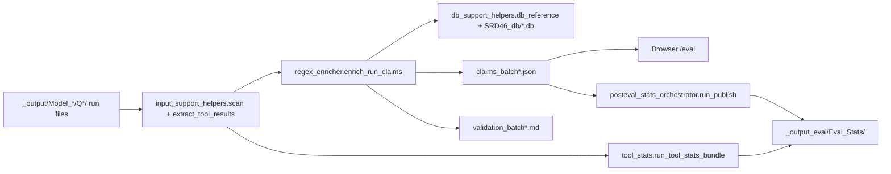

# SRD46 Query Output Eval Pipeline

`SRD46_query_output_eval_pipeline` is the active post-processing layer for SRD-46 agent runs. It parses `_output/` artifacts, extracts run-level evidence, classifies and grounds answer claims, and publishes aggregate statistics for the browser and for offline analysis.

## Pipeline Flow



## Active Responsibilities

1. Discover and parse run artifacts from `_output/`
2. Materialize answer text and tool-evaluation markdown into `_output_eval/`
3. Classify and ground claims against the SRD-46 databases
4. Publish validation summaries, post-eval statistics, and tool-usage statistics
5. Serve evaluation data to the Flask browser under `/eval`

The older rubric-driven score-report stack is no longer the main runtime path.

## Package Layout

### Shared models and orchestrators

- `models.py`: run-artifact dataclasses used across parsing and orchestration
- `regex_enricher_orchestrator.py`: batch entry point for extraction, claim enrichment, validation summary generation, and optional stats publication
- `posteval_stats_orchestrator.py`: canonical `Eval_Stats` publisher

### `input_support_helpers/`

- `scan.py`: discover runs under `_output/`
- `parse_history.py`: parse `Q*_history_batch*.md`
- `parse_ref_ids.py`: parse `Q*_ref_ids_batch*.md`
- `parse_result.py`: parse `Q*_result_batch*.md`
- `extract_tool_results.py`: write `answer_batch*.md` and `tool_eval_batch*.md`

### `db_support_helpers/`

- `db_reference.py`: read-only database access for grounding and reference lookup

### `regex_enricher/`

- `enricher.py`: run-level claim orchestration and cache management
- `validation.py`: unsupported-claim validation outputs
- `argo_enricher.py`: Argo integration support
- `claim_classifier/`: initial classification plus ReAct review helpers
- `claim_grounder/`: grounding plus ReAct patch helpers
- `regex_support_helpers/`: claim dataclasses, cache serialization, HTML rendering helpers

### `posteval_stats/`

This package publishes aggregate evaluation outputs, including CSV, JSON, figures, and audit bundles.

Key modules:

- `loader.py`
- `pipeline.py`
- `aggregate.py`
- `report.py`
- `origin_export.py`
- `plots.py`
- `prompt_registry.py`
- `revalidate.py`

Supporting folders include `audit/`, `csv/`, `json/`, `figures/`, `_data/`, and `origin_import/`.

### `tool_stats/`

Tool-call aggregation and export:

- `loader.py`
- `pipeline.py`
- `aggregate.py`
- `report.py`
- `origin_export.py`
- `plots.py`

### `workflow_diagram_builder/`

- `workflow_builder.py`: build workflow diagrams from parsed run histories

## Runtime Inputs And Outputs

### Consumed inputs

- `_output/Model_*/Q*/*_result_batch*.md`
- `_output/Model_*/Q*/*_history_batch*.md`
- `_output/Model_*/Q*/*_ref_ids_batch*.md`
- `SRD46_db/*.db`

### Produced outputs

Per run under `_output_eval/Model_*/Q*/`:

- `answer_batch*.md`
- `tool_eval_batch*.md`
- `claims_batch*.json`
- `claims_batch*.json.lock`
- `validation_batch*.md`

Per model:

- `validation_summary.md`

Published aggregates under `_output_eval/Eval_Stats/`:

- post-eval CSV and JSON exports
- plots and figure bundles when requested
- audit artifacts when requested
- tool statistics when published

## Orchestrator CLI

Primary entry point:

```bash
python -m SRD46_query_output_eval_pipeline.regex_enricher_orchestrator --model gpt54 --question Q1.1.1 --workers 1 --force
```

Thin wrapper:

```bash
python run_batch_output_claim_eval_subagent.py --model gpt54 --question Q1.1.1 --workers 1 --force
```

Important flags:

- `--model`
- `--question`
- `--workers`
- `--claim-paragraph-workers`
- `--argo-http-workers`
- `--force`
- `--extract-only`
- `--publish-eval-stats`
- `--publish-tool-stats`
- `--posteval-with-plots`
- `--posteval-with-audit`
- `--posteval-scope`
- `--tool-stats-scope`
- `--output-root`
- `--eval-root`
- `--stats-root`
- `--tool-stats-root`

## Browser Integration

`NIST_SRD46_database_browser/routes/evaluation.py` reads the same `_output/` and `_output_eval/` artifacts that this package creates. The browser can:

1. discover runs by model, question, and batch
2. load cached claim documents
3. render extracted markdown and annotated claim views
4. manage manual annotation and comment state

## Suggested Reading Order

1. `regex_enricher_orchestrator.py`
2. `input_support_helpers/scan.py`
3. `input_support_helpers/extract_tool_results.py`
4. `regex_enricher/enricher.py`
5. `regex_enricher/validation.py`
6. `posteval_stats_orchestrator.py`
7. `tool_stats/pipeline.py`

