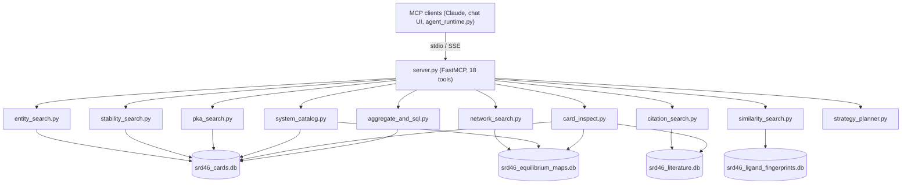

# SRD-46 Database Subagent — Tools Reference

> NIST Standard Reference Database 46: Critically Selected Stability Constants of Metal Complexes

This document details every MCP tool exposed by the SRD-46 subagent. Each tool section includes the function signature, parameter semantics, return schema, and internal logic. Historical LLM usage observations from 56 test prompts (333+ tool calls) are included where applicable.

---

## Architecture Overview



### Source Layout

```
SRD46_tools/
├── server.py                          # MCP server (FastMCP, 18 tools)
├── strategy_planner.py                # LLM-based triage + planning agent
├── compactor.py                       # Memory compression via LLM
├── postjob_verdict.py                 # Post-job review agent
├── tool_arg_normalizer.py             # CLI alias handling
└── Search_tools/
    ├── entity_search.py               # search_metals, search_ligands
    ├── stability_search.py            # search_stability
    ├── pka_search.py                  # search_pka_values, search_pka_ligands
    ├── network_search.py              # search_networks
    ├── citation_search.py             # search_citations
    ├── card_inspect.py                # inspect_card, inspect_literature
    ├── system_catalog.py              # build_system_catalog
    ├── similarity_search.py           # search_similar_ligands
    ├── aggregate_and_sql.py           # db_count_records, db_distribution,
    │                                  # db_ranked_pairs, get_table_schema,
    │                                  # execute_srd46_sql
    ├── db_connection.py               # SQLite context managers (cards/eq/lit + attach_all_dbs)
    ├── _db_connection.py              # legacy context-manager shim kept for backward imports
    ├── _search_helpers.py             # Validation, templating, HARD_LIMIT
    ├── _normalization_helpers/
    │   ├── id_prefixer.py             # Prefixed ID parsing (metal_41, vlm_12345)
    │   ├── metal_resolution.py        # Metal name expansion
    │   ├── ligand_resolution.py       # PubChemPy/RDKit fallback
    │   └── functional_group_catalog.py # SMARTS-based functional group filters
    └── _tools_results_compactors/     # Per-tool result summarizers for memory compaction
```

### Databases

| Database | File | Size | Purpose |
|----------|------|------|---------|
| Cards | `srd46_cards.db` | 158 MB | Metals, ligands, VLM cards, stability constants, pKa values |
| Equilibrium | `srd46_equilibrium_maps.db` | 28 MB | Equilibrium network maps |
| Literature | `srd46_literature.db` | 44 MB | Citation references |
| Fingerprints | `srd46_ligand_fingerprints.db` | 1 GB | Pre-computed Morgan/MACCS fingerprint similarities |

### Prefixed ID System

All entity IDs returned by tools use a prefix format that encodes the entity type:

| Prefix | DB Column | Example |
|--------|-----------|---------|
| `metal_` | `metal_id` | `metal_41` (Cu²⁺) |
| `ligand_` | `ligand_id` | `ligand_5760` (Glycine) |
| `vlm_` | `vlm_id` / `complex_system_id` | `vlm_93847` |
| `beta_def_` | `beta_definition_id` | `beta_def_812` |
| `pka_` | `pka_id` | `pka_1` |
| `ref_eq_map_` | `map_id` | `ref_eq_map_14` |
| `ref_eq_net_` | `network_db_id` | `ref_eq_net_86` |
| `lit_` | `literature_alt_id` | `lit_4321` |

Tools like `inspect_card`, `inspect_literature`, and `build_system_catalog` accept prefixed IDs directly. SQL-WHERE tools (`search_stability`, `search_pka_*`, `search_networks`, `search_citations`) also resolve prefixed IDs in WHERE clauses automatically (e.g. `c.metal_id = metal_41` is converted to `c.metal_id = 41`).

### WHERE-Clause Parser (sqlglot AST)

Every `where=` argument is parsed by `Search_tools/_sql_ast.py` (a thin wrapper over [sqlglot](https://github.com/tobymao/sqlglot), SQLite dialect) before reaching the database. The pipeline runs in this order:

1. **Column aliasing** (`apply_rewrites`) — per-tool maps in `tool_arg_normalizer.py` rewrite agent-friendly columns (e.g. `value` → `s.constant_value`).
2. **Django-style filters** (`fix_django_filters`) — `col__like='%X%'` → `col LIKE '%X%'`.
3. **Chemistry-literal canonicalization** (`normalize_chem_literals`) — string literals on chemistry columns are folded to canonical form. Composite WHEREs (`AND`/`OR`/`NOT`, `IN (...)`, `NOT IN`, `LIKE`/`NOT LIKE`, `<>`, sub-SELECTs) are walked node-by-node, so every comparison is normalized independently. See table below.
4. **Metal-name alias expansion** (`expand_metal_name_literals`) — English / oxidation-state / Latin metal aliases (`'copper(II)'`, `'cupric'`, `'ferric'`) are expanded to `IN`-lists that include the canonical DB form (`'Cu^[2+]'`). NEQ becomes `NOT IN`. Closes the GPT-5.4 *"agent tries one alias, gets 0 rows, gives up"* failure mode.
5. **Prefixed-ID resolution** (`resolve_prefixed_ids`) — `metal_41` → `41`, `ligand_5760` → `5760`, `beta_def_812` → `812`.
6. **Read-only validation** (`validate_read_only`) — DDL/DML node types (`DROP/DELETE/INSERT/UPDATE/ALTER/CREATE/TRUNCATE/REPLACE/PRAGMA/ATTACH/DETACH`) are rejected at any depth, while read-only sub-SELECTs (`EXISTS (SELECT …)`, `IN (SELECT …)`, `WITH … SELECT`) are explicitly **allowed**.

Because every step walks the AST, **string literals are never mutated** unless their containing predicate explicitly targets a chemistry column — values like `WHERE note = 'select me later'` or `WHERE comment = 'observed Cu2+ binding'` round-trip unchanged.

#### Chemistry literal canonicalization (step 3)

| Helper | Columns | Behaviour |
|--------|---------|-----------|
| Metal-charge folding | `metal_name`, `metal_name_SRD`, `symbol`, `metal_symbol` | `Cu2+` / `Cu²⁺` / `Cu+2` / `Cu^2+` / `Cu+` → `Cu^[2+]`. Wildcards in `LIKE '%Cu2+%'` preserved. |
| RDKit SMILES canonicalize | `smiles`, `SMILES`, `metal_smiles`, `ligand_smiles`, `canonical_smiles` | Non-canonical SMILES → RDKit canonical SMILES. `LIKE` patterns left alone. |
| RDKit InChI canonicalize | `inchi`, `InChI`, `metal_inchi`, `ligand_inchi` | Non-canonical InChI → RDKit canonical InChI. `LIKE` patterns left alone. |

Examples (all live-tested):

```sql
metal_name_SRD = 'Cu2+'                      -- chem-fold → 'Cu^[2+]'; then expanded:
                                             --   IN ('Cu2+', 'Cu^[2+]', 'Cu', 'copper')
metal_name_SRD = 'cupric'                    -- alias-expanded:
                                             --   IN ('cupric', 'copper', 'Cu^[2+]', 'Cu', 'Cu2+')
metal_name_SRD = 'copper(II)'                -- IN ('copper(II)', 'copper', 'Cu^[2+]', 'Cu', 'Cu2+')
metal_name_SRD <> 'cupric'                   -- NOT IN (...) so canonical row excluded too
metal_name_SRD IN ('copper(II)', 'iron(III)')-- each element expanded + deduped
metal_name_SRD NOT IN ('cupric', 'ferric')   -- each element expanded inside NOT IN
metal_name_SRD LIKE '%Cu2+%'                 -- chem-fold inside wildcards → '%Cu^[2+]%'
                                             -- (NOT alias-expanded; substring already covers aliases)
ligand_smiles  = 'C(=O)O'                    -- → RDKit canonical 'O=CO'

-- The most-complicated composite case: each comparison normalized independently.
(  (metal_name_SRD = 'cupric' OR metal_name_SRD IN ('iron(III)', 'Zn2+'))
   AND s.constant_value BETWEEN 5 AND 12
   AND lc.ligand_id IN (SELECT ligand_id FROM ligand_card WHERE ligand_smiles = 'CCO')
   AND lc.ligand_name_SRD LIKE '%glycine%'
   AND m.metal_name_SRD <> 'ferrous'
)
ORDER BY s.constant_value DESC
```

> **`ligand_name`/`ligand_name_SRD` are not expanded at WHERE time**:
> PubChem lookup is too slow for every query. Use `search_ligands(name=…)`
> first to resolve a chemical name to `ligand_id`, then filter by ID.
> The 0-row similarity fallback in `search_stability`/`pka`/`networks`
> *does* call PubChem internally — see next section.
> SMILES/InChI columns are RDKit-canonicalized.

### Ligand-Similarity Fallback (zero-result expansion)

`search_stability`, `search_pka_values`, and `search_networks` automatically widen the WHERE when:

- the user passes `ligand_similarity=True` (eager expansion), **or**
- the exact query returns zero rows (silent 0-row fallback).

The fallback path detects the ligand criterion (`ligand_id = N`, `ligand_id = ligand_NNN`, or `ligand_name LIKE '%X%'`) via AST walk, queries `srd46_ligand_fingerprints.db` for the top-K most similar ligands, and rewrites `ligand_id = N` → `ligand_id IN (N, N1, N2, …)`. Result rows are tagged with a `similarity_score` column. See [`Search_tools/README.md`](Search_tools/README.md) for the full per-tool pipeline.

### Chemical Name Resolution Pipeline

All name-based queries run through a multi-step resolution pipeline before reaching SQLite:

```
User input  ──→ _expand_metal_name()      (English → symbol: "copper" → "Cu")
            ──→ _resolve_ligand_identifiers()
                  1. InChI string?   → RDKit canonicalize
                  2. SMILES string?  → RDKit → canonical InChI + SMILES
                  3. Common name     → PubChemPy lookup → RDKit canonicalize
```

Dependencies: `rdkit >= 2024.x` (optional, graceful degradation), `pubchempy` (optional fallback).

### Functional Group Filtering

Several tools support SMARTS-based structural filtering:

- `include_groups` — only return ligands matching any of these functional groups
- `exclude_groups` — remove ligands matching any of these functional groups

Available groups are defined in `functional_group_catalog.py` and can be listed programmatically via `list_functional_groups()`.

---

## Tool Catalog — 18 MCP Tools

### Phase-Gating Tools (called first)

| # | MCP Tool Name | Source |
|---|---------------|--------|
| 1 | `0_preplan_decision` | `strategy_planner.py` |
| 2 | `0_plan_search_strategy` | `strategy_planner.py` |

### Entity Resolution Tools

| # | MCP Tool Name | Source |
|---|---------------|--------|
| 3 | `search_metals` | `entity_search.py` |
| 4 | `search_ligands` | `entity_search.py` |

### System Overview

| # | MCP Tool Name | Source |
|---|---------------|--------|
| 5 | `build_system_catalog` | `system_catalog.py` |

### SQL-WHERE Search Tools

| # | MCP Tool Name | Source |
|---|---------------|--------|
| 6 | `search_stability` | `stability_search.py` |
| 7 | `search_pka_values` | `pka_search.py` |
| 8 | `search_pka_ligands` | `pka_search.py` |
| 9 | `search_networks` | `network_search.py` |
| 10 | `search_citations` | `citation_search.py` |

### Card Inspection Tools

| # | MCP Tool Name | Source |
|---|---------------|--------|
| 11 | `inspect_card` | `card_inspect.py` |
| 12 | `inspect_literature` | `card_inspect.py` |

### Similarity Search

| # | MCP Tool Name | Source |
|---|---------------|--------|
| 13 | `search_similar_ligands` | `similarity_search.py` |

### Aggregate & Schema Tools

| # | MCP Tool Name | Source |
|---|---------------|--------|
| 14 | `db_count_records` | `aggregate_and_sql.py` |
| 15 | `db_distribution` | `aggregate_and_sql.py` |
| 16 | `db_ranked_pairs` | `aggregate_and_sql.py` |
| 17 | `get_table_schema` | `aggregate_and_sql.py` |
| 18 | `execute_srd46_sql` | `aggregate_and_sql.py` |

---

## Phase-Gating Tools

The agent runtime enforces a strict phase order: **preplan → L0 discovery → plan → execution**. These two tools orchestrate the first phases.

---

### `0_preplan_decision`

Fast triage: identify task type, metals, and ligands of interest. Call this FIRST — before any other tool.

#### Signature

```python
preplan_decision(
    question: str,           # the user's original chemistry question
) -> str                     # JSON
```

#### Return Schema

```json
{
  "task_type": "comparison | lookup | pKa | citation | provenance | exploration | multi-step",
  "metals": ["copper", "Fe3+"],
  "ligands": ["EDTA", "glycine"],
  "l0_needed": ["search_metals", "search_ligands", "build_catalog"],
  "notes": "One-sentence special instructions",
  "_meta": {
    "planner_model": "gpt54",
    "elapsed_s": 2.3
  }
}
```

#### Internal Logic

- Uses a lightweight LLM sub-agent call (temperature 0.1, max 500 tokens, 120s timeout)
- Parses the user's question to extract metal/ligand entities and classify the task
- The agent runtime uses the output to determine which L0 discovery tools to call

---

### `0_plan_search_strategy`

LLM-based strategy planner that converts a user's question into a structured search plan.

#### Signature

```python
plan_search_strategy(
    question:      str,          # the user's chemistry question
    context:       str  = "",    # prior results, catalog, or previous plan
    revision_note: str  = "",    # edits to apply to the plan in context
) -> str                         # plain-text advisory prefixed with [PLAN]
```

#### Return Schema

Returns a plain-text advisory (not strict JSON) prefixed with `[PLAN]` that suggests an approach, pitfalls to watch, and success criteria. The agent decides exact tool calls — the plan guides, not commands.

#### Revision Workflow

1. **First call**: `plan_search_strategy(question="Compare Cu-EDTA vs Cu-NTA")` → fresh strategy.
2. Main agent executes steps 1-2, discovers NTA returns 0 rows.
3. **Revision call**: pass the previous plan in `context` and describe what to change in `revision_note`. The planner updates only the affected steps.

#### Compressor Behaviour — `[PLAN]` / `[PLAN:DONE]` lifecycle

| State | Prefix | Compressible? |
|-------|--------|---------------|
| Active plan (agent still following it) | `[PLAN]` | **No** — skipped by compactor |
| Completed plan (agent delivered final answer) | `[PLAN:DONE]` | **Yes** — compactor may summarise it |

#### Domain Knowledge Encoded

The planner's system prompt includes:
- Full tool inventory with exact signatures and return schemas
- Data card structures (metal_card, ligand_card, etc.)
- Domain pitfalls (name resolution, partial match traps, oxidation states, etc.)
- Workflow templates for common question types
- Solution thermodynamics concepts (Irving-Williams, HSAB, chelate effect)
- Multi-component system handling

---

## Entity Resolution Tools

*Source: `Search_tools/entity_search.py`*

---

### `search_metals`

Search metal ions in the SRD-46 metal registry.

#### Signature

```python
search_metals(
    name:     Optional[str] = None,    # partial match — "Copper", "Iron", "Cu"
    symbol:   Optional[str] = None,    # partial match — "Cu2+", "Fe^[3+]"
    metal_id: Optional[int] = None,    # exact match (also accepts "metal_41")
    smiles:   Optional[str] = None,    # partial SMILES — "[Cu+2]"
    inchi:    Optional[str] = None,    # partial InChI
    limit:    int = 50,
    exclude:  Optional[str] = None,    # comma-separated metal_ids to exclude
) -> list[dict]
```

#### Return Schema

| Key | Type | Description |
|-----|------|-------------|
| `metal_id` | str | Prefixed ID, e.g. `"metal_41"` |
| `metal_name` | str | DB name, e.g. `"Cu^[2+]"`, `"Fe^[3+]"` |
| `symbol` | str | Element symbol, e.g. `"Cu"`, `"Fe"` |
| `charge` | int | Formal charge |
| `is_simple_ion` | int | 1 = simple ion, 0 = organometallic |
| `smiles` | str | SMILES representation |
| `inchi` | str | InChI string |
| `beta_def_count` | int | Number of distinct species stoichiometries |
| `ligand_count` | int | Number of distinct ligand partners |
| `vlm_count` | int | Total VLM measurements for this metal |

#### Internal Logic

- The `name` parameter triggers `_expand_metal_name()`, which generates multiple search terms. For example, `"copper(II)"` expands to `{"copper", "copper(II)", "Cu"}`, each matched with `LIKE` against both `metal_name_SRD` and `symbol_pure` columns.
- Handles DB-native format (`Cu^[2+]`), bare charge (`Cu2+`), parenthesized oxidation state (`copper(II)`), English names (`copper`), and reverse symbol-to-name lookups.
- All terms are OR'd together for broad matching.
- Enrichment: attaches `beta_def_count`, `ligand_count`, `vlm_count` from `ligandmetal_card` GROUP BY.

#### Observed LLM Usage

- **Frequently the very first tool called** in multi-step workflows. Used to resolve human-friendly names to `metal_id` values.
- Typically returns 1–10 rows; the LLM rarely needs more than `limit=10`.

---

### `search_ligands`

Search ligands in the SRD-46 ligand registry with PubChemPy fallback and functional group filtering.

#### Signature

```python
search_ligands(
    name:           Optional[str] = None,       # partial match — "Glycine", "EDTA"
    formula:        Optional[str] = None,       # partial match — "C2H5NO2"
    ligand_class:   Optional[str] = None,       # partial match — "amino acid"
    ligand_id:      Optional[int] = None,       # exact match (also accepts "ligand_5760")
    smiles:         Optional[str] = None,       # partial SMILES
    inchi:          Optional[str] = None,       # partial InChI
    limit:          int = 50,
    exclude:        Optional[str] = None,       # comma-separated ligand_ids to exclude
    include_groups: Optional[list[str]] = None, # SMARTS functional group whitelist
    exclude_groups: Optional[list[str]] = None, # SMARTS functional group blacklist
) -> dict
```

#### Return Schema

```json
{
  "results": [
    {
      "ligand_id": "ligand_5760",
      "ligand_name": "Aminoacetic acid (Glycine)",
      "ligand_HxL_definition": "H2L+",
      "formula": "C2H5N1O2",
      "ligand_class": "Amino Acids",
      "iupac_name": "...",
      "common_name": "Glycine",
      "smiles": "...",
      "inchi": "...",
      "pka_brackets": [...],
      "vlm_count": 150
    }
  ],
  "total_sql_matches": 3,
  "excluded_by_groups": 0,
  "limit": 50,
  "all_smiles": ["..."]
}
```

#### Internal Logic

- Direct `LIKE` matching on the specified columns.
- **Automatic PubChemPy fallback**: If a name-only search returns 0 rows, the function calls `_resolve_ligand_identifiers(name)` to get a canonical InChI (via PubChemPy + RDKit), then retries with `ligand_InChi LIKE ?`. If still empty, retries with `ligand_SMILES LIKE ?`.
- **Functional group filtering**: After SQL results, applies SMARTS-based structural filters using RDKit.
- **Enrichment**: attaches `pka_brackets` from `ligand_pka_bracket` and `vlm_count` from `ligandmetal_card`.

#### Observed LLM Usage

- Used for **ligand disambiguation**. The DB stores ligands under formal chemical names (e.g., `"Aminoacetic acid (Glycine)"` rather than `"glycine"`).
- When searching by class (e.g., `ligand_class="amino acid"`), returns up to 50 ligands — useful for broad surveys.

---

## System Overview Tool

*Source: `Search_tools/system_catalog.py`*

---

### `build_system_catalog`

Species / network catalog for a metal–ligand system. Call this **after** `search_metals` and `search_ligands` — pass the resolved numeric or prefixed IDs.

#### Signature

```python
build_system_catalog(
    metal_id:           Optional[int | str] = None,   # accepts "metal_41" or 41
    ligand_id:          Optional[int | str] = None,   # accepts "ligand_5760" or 5760
    beta_definition_id: Optional[int | str] = None,   # accepts "beta_def_812" or 812
) -> str                                              # "[CATALOG]\n" + JSON
```

#### Return Schema

```json
{
  "pairs": [
    {
      "metal_id": "metal_41",
      "ligand_id": "ligand_5760",
      "metal_name": "Cu^[2+]",
      "ligand_name": "Aminoacetic acid (Glycine)",
      "species_catalog": [
        {
          "beta_definition_id": "beta_def_78",
          "equation_str": "[M] + [L] <=> [ML]",
          "n_entries": 42
        }
      ],
      "vlm_ids": ["vlm_1001", "vlm_1002"],
      "networks": [
        {
          "collection_id": 10, "network_id": 3,
          "node_count": 12, "edge_count": 15,
          "temp_min": 20.0, "temp_max": 25.0,
          "ionic_min": 0.1, "ionic_max": 1.0
        }
      ]
    }
  ],
  "summary": {
    "n_metals": 1,
    "n_ligands": 1,
    "n_pairs": 1,
    "total_species": 5
  }
}
```

#### Compressor Behaviour

Result is prefixed with `[CATALOG]` and skipped by the compactor's candidate selection loop. This ensures the catalog remains available in full throughout the entire agent conversation.

---

## SQL-WHERE Search Tools

These tools use a SQL WHERE-clause interface for flexible querying. The `where` parameter accepts valid SQL WHERE expressions using the documented column prefixes.

---

### `search_stability`

*Source: `Search_tools/stability_search.py`*

SQL-WHERE stability search over `ligandmetal_card` joined with `ligandmetal_stability_measured`.

#### Signature

```python
search_stability(
    sql_where_query:  str = "1=1",                  # full SQL WHERE + optional ORDER BY / LIMIT
    ligand_similarity: bool = False,                # auto-expand via similar ligands if 0 rows
    include_groups:   Optional[list[str]] = None,   # SMARTS whitelist
    exclude_groups:   Optional[list[str]] = None,   # SMARTS blacklist
) -> list[dict]
```

The `sql_where_query` accepts a full SQL `WHERE` body with optional trailing
`ORDER BY` and `LIMIT`, e.g. `"c.metal_id = 41 AND c.ligand_id IN (5760, 9058) ORDER BY s.constant_value DESC LIMIT 20"`.
A leading `WHERE` keyword is tolerated and stripped automatically.

#### Column Prefixes

| Prefix | Table | Key Columns |
|--------|-------|-------------|
| `c.` | `ligandmetal_card` | `metal_id`, `ligand_id`, `beta_definition_id`, `metal_name_SRD`, `ligand_name_SRD`, `beta_definition_name`, `ligand_class_name` |
| `s.` | `ligandmetal_stability_measured` | `constant_type`, `constant_value`, `temperature_c`, `ionic_strength_mol_l`, `reaction_type`, `solvent_name`, `electrolyte`, `equation_str` |

#### Return Schema

Each row includes:

| Key | Type | Description |
|-----|------|-------------|
| `vlm_id` | str | Prefixed VLM ID, e.g. `"vlm_93847"` |
| `metal_id` | str | Prefixed, e.g. `"metal_41"` |
| `ligand_id` | str | Prefixed, e.g. `"ligand_5760"` |
| `beta_definition_id` | str | Prefixed, e.g. `"beta_def_78"` |
| `beta_definition_name` | str | Human-readable species, e.g. `"[ML]/[M][L]"` |
| `metal_name` | str | Metal name from card |
| `ligand_name` | str | Ligand name from card |
| `constant_type` | str | `"K"` (stepwise) or `"β"` (cumulative) |
| `log_K` | float | Log of the equilibrium constant |
| `temperature` | float | Temperature in °C |
| `ionic_strength` | float | Ionic strength in mol/L |
| `equation_str` | str | Human-readable equation |
| `reaction_type` | str | e.g. `"homogeneous aqueous"` |
| `solvent` | str | Solvent name |
| `electrolyte` | str | Background electrolyte |
| `LHS_species_json` | str | JSON array of LHS species with phase |
| `RHS_species_json` | str | JSON array of RHS species with phase |
| `equation_tree_json` | str | Full equation tree with stoichiometry and phases |
| `pKa_bracket_involved` | list | Parsed pKa brackets for the involved protonation states |
| `map_id` | str\|null | Linked equilibrium map ID (if in a network) |

#### Internal Logic

- **Similarity fallback**: When `ligand_similarity=True` and the query returns 0 rows, automatically expands the search to structurally similar ligands.
- **Hard limit**: 200 rows maximum (over-fetch ceiling for group-filter post-processing). Use an explicit `LIMIT N` inside `sql_where_query` to cap at fewer rows.

#### Observed LLM Usage

- **The most heavily used tool** across all test prompts. Called in almost every query.
- Common patterns: broad sweep (`LIMIT 10` inside the query), species-specific drill-down (`c.beta_definition_id = 78`), condition-filtered (`s.temperature_c = 25`), batch-by-IN-list (`c.ligand_id IN (5760, 9058, 9163)`).

---

### `search_pka_values`

*Source: `Search_tools/pka_search.py`*

Value-centric pKa search — one row per pKa measurement record.

#### Signature

```python
search_pka_values(
    sql_where_query:  str = "1=1",                  # full SQL WHERE + optional ORDER BY / LIMIT
    ligand_similarity: bool = False,
    include_groups:   Optional[list[str]] = None,
    exclude_groups:   Optional[list[str]] = None,
) -> list[dict]
```

#### Column Prefixes

| Prefix | Table | Key Columns |
|--------|-------|-------------|
| `lc.` | `ligand_card` | `ligand_id`, `ligand_name_SRD`, `ligand_class_name`, `formula` |
| `p.` | `ligand_pka_measured` | `pKa`, `pKa_type`, `temperature_c`, `ionic_strength_mol_l`, `bracket_from_state`, `bracket_to_state`, `method`, `quality` |

#### Return Schema

Each row includes ligand info + pKa value + metal count statistics (`M_tot`, `M_above`, `M_below`).

---

### `search_pka_ligands`

*Source: `Search_tools/pka_search.py`*

Ligand-centric pKa search — groups by ligand, includes the full protonation ladder.

#### Signature

Same parameters as `search_pka_values`.

#### Return Schema

One row per ligand with all its pKa values aggregated and bracket sequence information.

---

### `search_networks`

*Source: `Search_tools/network_search.py`*

SQL-WHERE equilibrium network search. The `limit` applies to distinct networks; **all nodes** for matching networks are returned.

#### Signature

```python
search_networks(
    sql_where_query:  str = "1=1",                  # full SQL WHERE + optional ORDER BY / LIMIT
    ligand_similarity: bool = False,
) -> list[dict]
```

#### Column Prefixes

| Prefix | Table | Key Columns |
|--------|-------|-------------|
| `c.` | `eq_map_collection` | `metal_id`, `ligand_id`, `metal_name`, `ligand_name` |
| `m.` | `eq_map` | `condition_temp_min`, `condition_temp_max`, `condition_ionic_min`, `condition_ionic_max` |
| `n.` | `eq_network` | `node_count`, `edge_count` |
| `nd.` | `eq_node` | `vlm_id`, `beta_definition_id`, `constant_type`, `constant_value` |

#### Return Schema

Each row includes network node data with condition ranges (temp_min, temp_max, ionic_min, ionic_max).

---

### `search_citations`

*Source: `Search_tools/citation_search.py`*

SQL-WHERE literature citation search grouped by unique citation.

#### Signature

```python
search_citations(
    sql_where_query: str = "1=1",                  # full SQL WHERE + optional ORDER BY / LIMIT
) -> list[dict]
```

#### Column Prefixes

| Prefix | Table | Key Columns |
|--------|-------|-------------|
| `rv.` | `ref_vlm_literature_alt` | `vlm_id` |
| `la.` | `ref_literature_alt` | `literature_alt_id`, `shortcut`, `citation` |

#### Return Schema

| Key | Type | Description |
|-----|------|-------------|
| `example_vlm_id` | str | One VLM ID linked to this citation |
| `vlm_count` | int | Total VLMs linked to this citation |
| `literature_alt_id` | int | Citation identifier |
| `shortcut` | str | Short code, e.g. `"62Pc"` |
| `citation` | str | Full citation text |

#### Usage Example

```
# Find citation by shortcut code
search_citations(sql_where_query="la.shortcut = '62Pc'")

# Find citations for a specific VLM (or a batch of VLMs)
search_citations(sql_where_query="rv.vlm_id IN (93606, 93607) ORDER BY la.citation LIMIT 10")
```

---

## Card Inspection Tools

*Source: `Search_tools/card_inspect.py`*

Deep-inspection tools that return comprehensive detail for a single entity, including related records across databases.

---

### `inspect_card`

Full card inspection for a single metal, ligand, or VLM measurement.

#### Signature

```python
inspect_card(
    prefix_id: str,     # "metal_N", "ligand_N", or "vlm_N"
) -> dict
```

#### Return Schema (varies by entity type)

**Metal** (`metal_N`): card data + top 5 ligand partners + totals.

**Ligand** (`ligand_N`): card data + all pKa values + metal partner summary.

**VLM** (`vlm_N`): full measurement card + parsed equation + speciation + related equilibrium network + literature citations.

---

### `inspect_literature`

Return all citation rows for one VLM measurement.

#### Signature

```python
inspect_literature(
    prefix_id: str,     # "vlm_N"
) -> dict
```

#### Return Schema

```json
{
  "vlm_id": "vlm_93847",
  "metadata": { ... },
  "citations": [
    {"shortcut": "62Pc", "citation": "...full citation..."},
    ...
  ]
}
```

---

## Similarity Search

*Source: `Search_tools/similarity_search.py`*

---

### `search_similar_ligands`

Fingerprint-based structural similarity search using pre-computed Morgan and MACCS fingerprints from `srd46_ligand_fingerprints.db`.

#### Signature

```python
search_similar_ligands(
    ligand_id:   Optional[int | str] = None,    # exact ID or "ligand_N"
    ligand_name: Optional[str] = None,          # resolved via search_ligands
    top_k:       int = 10,                      # number of similar ligands to return
    metal_ids:   Optional[str | list[int]] = None,  # filter by metals with map coverage
) -> dict
```

#### Return Schema

```json
{
  "query_ligand": { "ligand_id": "ligand_5760", "ligand_name": "...", "smiles": "..." },
  "query_eq_richness": { ... },
  "metal_filter": [41],
  "similar_ligands": [
    {
      "ligand_id": "ligand_1234",
      "ligand_name": "...",
      "smiles": "...",
      "family_score": 0.85,
      "similarity_score": 0.72,
      "tversky_query_in_target": 0.90,
      "tversky_target_in_query": 0.65,
      "eq_richness": { ... }
    }
  ]
}
```

#### Score Semantics

| Score | Fingerprint | Meaning |
|-------|------------|---------|
| `family_score` | MACCS (Tanimoto) | Structural family similarity |
| `similarity_score` | Morgan (Tanimoto) | Fine-grained structural similarity |
| `tversky_query_in_target` | Morgan (Tversky) | How much of query's substructure is in target |
| `tversky_target_in_query` | Morgan (Tversky) | How much of target's substructure is in query |

---

## Aggregate & Schema Tools

*Source: `Search_tools/aggregate_and_sql.py`*

---

### `db_count_records`

Count rows in an allowed SRD-46 table, optionally filtered.

#### Signature

```python
db_count_records(
    table: str,                    # e.g. "metal_card", "ligandmetal_card"
    where: Optional[str] = None,   # SQL WHERE clause
) -> dict
```

---

### `db_distribution`

Compute a grouped value distribution for an allowed table/column.

#### Signature

```python
db_distribution(
    table:        str,                    # e.g. "ligand_card"
    group_column: str,                    # e.g. "ligand_class_name"
    where:        Optional[str] = None,
    limit:        int = 25,
) -> list[dict]
```

Returns `[{"value": "Amino Acids", "count": 42}, ...]`.

---

### `db_ranked_pairs`

Rank metals or ligands by partner count or measurement count.

#### Signature

```python
db_ranked_pairs(
    rank_by: str = "ligands_per_metal",   # see modes below
    limit:   int = 20,
    where:   Optional[str] = None,
) -> list[dict]
```

#### Modes

| `rank_by` | Ranks |
|-----------|-------|
| `"ligands_per_metal"` | Metals by number of distinct ligand partners |
| `"metals_per_ligand"` | Ligands by number of distinct metal partners |
| `"measurements_per_metal"` | Metals by total VLM measurement count |
| `"measurements_per_ligand"` | Ligands by total VLM measurement count |

---

### `get_table_schema`

Return column names, types, and constraints for any table.

#### Signature

```python
get_table_schema(
    table_name: str,              # e.g. "metal_card", "eq_node"
    database:   str = "cards",    # "cards", "equilibrium", or "literature"
) -> list[dict]
```

If the table doesn't exist, returns `{"error": "...", "available_tables": [...]}`.

---

### `execute_srd46_sql`

Execute capped read-only SQL across the SRD-46 databases.

**Highest-level / advanced tool.** Most powerful query path, but assumes the
agent is already comfortable with the canonical entities (metal_id /
ligand_id / beta_definition_id), the cards / stability_measured column
semantics, and how those entities relate chemically. Use for multi-table
self-joins, custom aggregations, or derived columns (e.g. ΔlogK selectivity)
that the structured tools cannot express.

#### Signature

```python
execute_srd46_sql(
    sql_query:           str,               # read-only SQL (SELECT / WITH / PRAGMA only)
    task_description:    str,               # REQUIRED, >=40 chars; one brief sentence
    column_legend:       dict[str, str],    # REQUIRED, one entry per SELECT column / alias
    attach_equilibrium:  bool = False,      # enable eqdb. prefix
    attach_literature:   bool = False,      # enable litdb. prefix
) -> dict
```

#### Required Context Arguments

- **`task_description`** (>=40 chars, one brief sentence) — the chemistry
  question the SQL answers. Be terse; do NOT restate the SQL in prose.
- **`column_legend`** — dict mapping every output column (including SELECT
  aliases such as `logK_Fe3` and computed columns such as `delta_logK`) to a
  chemistry-aware string covering (1) source table.column or formula,
  (2) filter/join, (3) physical meaning + units + species / protonation /
  oxidation state, (4) for computed cols, formula AND interpretation.

Both are echoed verbatim inside a `<tool_context>` block in the run history
alongside the result rows so the claim-grounding pipeline can audit the
agent's *intent* alongside the data.

#### Result Compaction

The `execute_srd46_sql` compactor automatically:

- Wraps `task_description` + `column_legend` + post-AST-rewrite SQL in a
  `<tool_context>` block.
- **Auto-enriches** bare entity-ID columns: any `metal_id` / `ligand_id` /
  `beta_definition_id` that appears in your SELECT is resolved against the
  canonical entity tables for the *fields the SELECT omitted* (metal name,
  symbol, charge; ligand name, HxL form, SMILES, pKa brackets; representative
  beta `equation_str`). Per-field gap-only — if the SELECT already exposes the
  canonical field, it is not duplicated; if every canonical field is present,
  the enrichment block for that entity type is omitted entirely.
- **Constant-column hoisting**: if a column has the same value in every row,
  it is lifted into a `**Shared across all N rows:**` preamble and dropped
  from the table body (only when at least one column varies).

#### Connection Layout

| Scope | Prefix | Database |
|-------|--------|----------|
| Primary | (none) | `srd46_cards.db` |
| Equilibrium | `eqdb.` | `srd46_equilibrium_maps.db` |
| Literature | `litdb.` | `srd46_literature.db` |

#### Safety

- **Read-only enforcement**: Blocks `DROP`, `DELETE`, `INSERT`, `UPDATE`, `ALTER`, `CREATE`, `REPLACE`, `TRUNCATE`.
- **Row cap**: 50 rows maximum.
- **Sub-SELECT in WHERE**: Blocked for safety.
---

## Agent Runtime Components

### Memory Compactor

*Source: `SRD46_tools/compactor.py`*

Summarises old tool-result turns via an LLM sub-agent so the conversation prompt stays bounded. Each tool type has a dedicated compactor function in `_tools_results_compactors/` that produces domain-aware summaries.

After compression, the **main agent** is shown the proposed summary and decides whether to ACCEPT or REJECT it. If rejected, the original result is tagged `[RETRY]` and can be offered again in future rounds.

#### Key Parameters (from `argo_config.py`)

| Parameter | Value | Description |
|-----------|-------|-------------|
| `KEEP_RECENT_RESULTS` | 2 | Most-recent results to keep uncompressed |
| `COMPACTED_MAX_CHARS` | 500 | Fallback preview if LLM summary fails |
| `REASONING_CAP` | 3,000 | Max chars of reasoning prefix kept |
| `MIN_COMPRESS_CHARS` | 500 | Results below this are already compact — skip |
| `MAX_RETRY` | 5 | After N rejections, permanently keep original |

---

### Verdict Agent

*Source: `SRD46_tools/postjob_verdict.py`*

Independent LLM review agent that runs automatically after every `agent_turn()` completes. Not part of the ReAct loop.

#### Purpose

Produces a combined **Verdict + Explanation** block (≤100 words):

1. **Verdict** (1-2 sentences): Did the subagent fully answer the user's question?
2. **Explanation** (2-3 sentences): Plain-language scientific summary of what the retrieved data means.

#### Input

| Source | Content |
|--------|---------|
| User question | Original user message |
| Tool history | Ordered list of tool names called during the turn |
| System catalog | `[CATALOG]` block if present in memory |
| Final answer | Subagent's final response (first 3,000 chars) |

---

## Agent Configuration

All configuration lives in `argo_config.py`:

| Parameter | Value | Description |
|-----------|-------|-------------|
| `MODEL` | `"gpt54"` | Main agent + MCP server model |
| `VERDICT_MODEL` | `"gpt54"` | Post-job review model |
| `PLANNER_MODEL` | `"gpt54"` | Strategy planner + evaluator model |
| `ENRICHER_MODEL` | `"gpt54"` | Regex enricher / legacy enrichment model |
| `CLAIM_CLASSIFIER_MODEL` | `"gpt5"` | Claim classification model |
| `GROUNDER_MODEL` | `"gpt5"` | Claim grounding + validation model |
| `CLAIM_PARAGRAPH_WORKERS` | 10 | Per-answer workers for classify and ground phases |
| `ARGO_MAX_CONCURRENT_REQUESTS` | 10 | Process-wide cap on concurrent Argo HTTP calls |
| `TEMPERATURE` | 0.3 | Main agent temperature |
| `TOP_P` | 0.9 | Main agent top-p (omitted for Claude models) |
| `MAX_TOKENS` | 6,000 | Soft cap per LLM call |
| `MAX_TOOL_ITERATIONS` | 20 | Hard cap on tool calls per user turn |
| `MAX_TURN_SECONDS` | 600 | Soft time limit per user turn (10 min) |

---

## Observed LLM Behavioral Patterns (from 56 test prompts)

### Common Workflow Patterns

**Pattern 1: Preplan → Resolve → Query → Refine** (standard)
```
Step 1: 0_preplan_decision(question="...")          → task triage
Step 2: search_metals(name="copper")                → get metal_id=metal_41
Step 3: search_ligands(name="glycine")              → get ligand_id=ligand_5760
Step 4: build_system_catalog(metal_id="metal_41", ligand_id="ligand_5760")
Step 5: 0_plan_search_strategy(question="...", context="<catalog>")
Step 6: search_stability(where="c.metal_id = 41 AND c.ligand_id = 5760")
```

**Pattern 2: Schema → SQL** (data profiling)
```
Step 1: get_table_schema(table_name="ligandmetal_stability_measured")
Step 2: execute_srd46_sql(sql_query="SELECT COUNT(*)...")
```

**Pattern 3: Search → Inspect** (deep detail)
```
Step 1: search_stability(where="...") → identify vlm_id
Step 2: inspect_card(prefix_id="vlm_93847")
Step 3: inspect_literature(prefix_id="vlm_93847")
```

**Pattern 4: Similarity-based exploration**
```
Step 1: search_ligands(name="EDTA") → get ligand_id
Step 2: search_similar_ligands(ligand_id="ligand_5760", metal_ids="41")
Step 3: search_stability(where="c.ligand_id = <similar_ligand_id>")
```

### Error Recovery Patterns

- **0-row retry with relaxed parameters**: The LLM drops one constraint, increases `limit`, or broadens the name query.
- **Similarity fallback**: Uses `ligand_similarity=True` to auto-expand failed searches to structurally similar ligands.
- **Redundant L0 lookups**: The LLM sometimes calls entity search tools even though SQL-WHERE tools accept names directly — this adds a step but produces cleaner results via exact ID matching.
